# MODEL


RDB 

R -> relational(관계적 데이터타입)

DB를 사용한다는 것 -> table을 사용한다

table -> class를 정의해서 사용

Migrations : table을 만든다


model에다가 class 정의


---

\# articles라고 만들었지만 사실상 우리는 여기에서 table을 만들것임

\# 복수형으로 만드는 이유는 여러가지 정보들을 제공할 것이기 때문에

\# table 변수명은 단수로 작성한다(각각의 정보를 뽑아서 제공할 것이기 때문에)

\# class 정의를 할 때 이름 첫 글자는 대문자로! ex) class 'A'rticles


##### 0.클래스 정의하기

```python
from turtle import title
from django.db import models

\# Create your models here.

class Article(models.Model): #title,content가 table 의 field name이 되는 것

  title = models.CharField(max_length=10) #field에 저장되는 date들의 type을 지정해 줄 것 (근데 int,str같은 게 아니라 models에 들어있는 타입들임!) 최대 10글자까지 표현 인 듯

  content = models.TextField()#가장 긴 문자열을 뽑는 method
```


class 정의 이후

##### 1.migrations 설치 

```bash
$ python manage.py makemigrations
Migrations for 'articles':
  articles\migrations\0001_initial.py
    - Create model Article
```

 라는 창이 뜸

 그 이후 `migrations` > `__init__` > `0001_initial.py`에 들어가보면 `operations`에 내가 만든 class들이 들어가 있는 걸 확인할 수 있음.

```python
#0001_initial.py 내부

from django.db import migrations, models


class Migration(migrations.Migration):

    initial = True

    dependencies = [
    ]

    operations = [
        migrations.CreateModel(
            name='Article',
            fields=[
                ('id', models.BigAutoField(auto_created=True, primary_key=True, serialize=False, verbose_name='ID')),
                ('title', models.CharField(max_length=10)),
                ('content', models.TextField()),
            ],
        ),
    ]
```


##### 2.확인해보기

```bash
$ python manage.py  migrate
Operations to perform:
  Apply all migrations: admin, articles, auth, contenttypes, sessions
Running migrations:
  Applying contenttypes.0001_initial... OK
  Applying auth.0001_initial... OK
  Applying admin.0001_initial... OK
  Applying admin.0002_logentry_remove_auto_add... OK
  Applying admin.0003_logentry_add_action_flag_choices... OK
  Applying articles.0001_initial... OK
  Applying contenttypes.0002_remove_content_type_name... OK
  Applying auth.0002_alter_permission_name_max_length... OK
  Applying auth.0003_alter_user_email_max_length... OK
  Applying auth.0004_alter_user_username_opts... OK
  Applying auth.0005_alter_user_last_login_null... OK
  Applying auth.0006_require_contenttypes_0002... OK
  Applying auth.0007_alter_validators_add_error_messages... OK
  Applying auth.0008_alter_user_username_max_length... OK
  Applying auth.0009_alter_user_last_name_max_length... OK
  Applying auth.0010_alter_group_name_max_length... OK
  Applying auth.0011_update_proxy_permissions... OK
  Applying auth.0012_alter_user_first_name_max_length... OK
  Applying sessions.0001_initial... OK
(venv)
```


##### 3.SQLite 설치하기


##### 4.venv>db.sqlite3>우클릭>open database 누르기

=> 새로운 `SQLITE EXPLORE`라는 TAP(OUTLINE 밑) 생성

눌러보면 

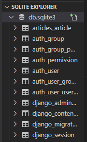

이렇게 생성된 것을 알 수 있습니당

```
우리가 사실적으로 만든 것은 제일 위에 있는 articles_article.
나머지 auth / django는 다른 앱들(장고에서 사용하는 다른 앱들이 쓰기 위해서 만들어진 table)
```

##### articles_article 클릭

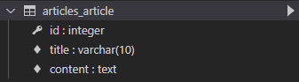

```
title과 content는 만들었는데 id는 안만들었는뎅
id는 기본적으로 만들어짐(Primary Key)
일반적으로 필드들을 정의하게 되면 기본적으로 (default로) id라는 이름을 가진 필드를 만듦
여기선 정수값을 제공
따로 설정하지 않아도 자동으로 값이 채워지면서 (자동으로 정수값이 1씩 증가하는 상태를 제공)
record를 기록하기 위한 primary key가 필요함. 근데 따로 설정해주지 않으면 자동으로 key를 저장해주는 id가 생성된다.
```


class정의 > DB반영 사이에 두 단계 존재

1.migration만들기(만들어놓기만 할 뿐 반영 x)

2.실제 DB에 반영하려면 `migrate`라는 명령어를 사용해서 적용해준다

```
추가적으로 두 개의 명령어가 더 있음
1.sqlmigrate
-> 실제로 작성된 pyhton코드가 대응된 SQL은 무엇인지 확인하기 위해서 필요함
(나중에 SQL 배우면 필요 x)
2.showmigrations
-> migration file들(== 설계도)가 적용되어 있는지 확인하기
```

1)sqlmigrate

```bash
$ python manage.py sqlmigrate articles  0001_initial
BEGIN;
--
-- Create model Article (사실상 주석)
--
CREATE TABLE "articles_article" ("id" integer NOT NULL PRIMARY KEY AUTOINCREMENT, "title" varchar(10) NOT NULL, "content" text NOT NULL);
COMMIT;
(venv) 
#app_label,migration_name 주기
```

```
what means "NOT NULL"?
-> NULL 값을 지정할 수 없다
```


```
 <Article: Article object (None)>
 
 none -> 원래 pk 값이 들어가는데 지금은 없어서 none 반환
```


영상 2:49분 영상 초반에 

list_display = (튜플 형태로 묶는다)


---

Database API

Database의 어떤 조작을 하기 위해서 우리가 사용해야하는 method나 이런 것들을 소개하는 것

model을 정의해서 migration을 해서 db에 반영을 하면 article class가 결국 DB에 table이 생김(class에 대응하는). 

그러면 Article class에 instance를 생성해서 쓰게 됨 (내부적으로 생성이 됨)

추가적으로 각각의 클래스에 뭔가 Model을 상속받아가지고 정의를 했는데. Model 안에 우리가 쓸 수 있는 것들이 있음. 그게 method, 속성들이 정의되어 있겠죠 (Model에)


classname.`objects`.QuerySet

```
중간 objects라는 manager가 있어야함
기본적으로 모든 django 모델 클래스에 objects라는 manager를 추가!
```

```
Queryset
한 행에 대해 존재하는 
객체들의 목록
각각의 객체들은 결국 하나의 record에 대응(한 행에 대응) 하는 것들의 집합.

유사 list

```


---

## Create

##### Save(insert)

DB에 새로운 data를 저장하고 싶으면 그 DB에 대응하는 class instance를 만들고 필요한 field의 값을 설정하고, 그리고 save를 호출하면 현재 설정된 값들이 DB에 반응이 된다

save가 DB에 뭔가 데이터를 반영하는 method가 된다

aritlcles.save() <- 중요!

##### 1.빈 instance를 만들고 각각 값을 setting 후 !!save!!

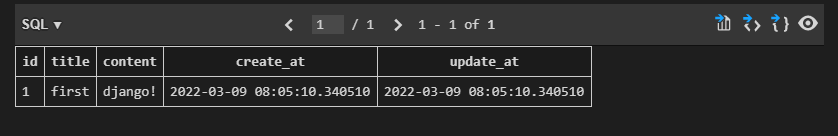

```
#빈 쿼리셋 확인
In [1]: Article.objects.all()
Out[1]: <QuerySet []>

In [2]: articles = Article.objects.all()

In [3]: articles
Out[3]: <QuerySet []>

In [4]: type(articles)
Out[4]: django.db.models.query.QuerySet

In [8]: article.title
Out[8]: ''


#article에 title, content 설정

In [9]: article.title = 'first'

In [10]: article.content = 'django!'

#설정값을 확인하면 나오지만
In [11]: article.title
Out[11]: 'first'

#save가 안됐기 때문에 아직 pk값이 없음
In [12]: article
Out[12]: <Article: Article object (None)>

#save가 안됐기 때문에 여전히 비어있는 쿼리셋
In [13]: Article.objects.all()
Out[13]: <QuerySet []>

#save 저장
In [15]: article.save()

#저장 후 재확인 해보면 저장되어있는 걸 알 수 있음
##(1) -> id값 (pk)
In [16]: Article.objects.all()
Out[16]: <QuerySet [<Article: Article object (1)>]>
```

```
table 내용 보는 법
db.sqlite3 > articles_article > 세모버튼 클릭(show table)
```

##### 2.instance를 생성할 때 field 값을 생성할 때 바로 주기

(model class에 선언한 field 이름들을 키워드 인자로 쓸 수 있음)

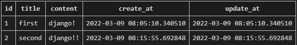

```

처음에 생성할 때 field이름을 쓰고, value를 써주면 그 값으로 instance를 만들어줌 )
그러고 나서 당연히 !!save!! 해야함

In [18]: article.create_at
Out[18]: datetime.datetime(2022, 3, 9, 8, 5, 10, 340510, tzinfo=<UTC>)

In [19]: article.update_at
Out[19]: datetime.datetime(2022, 3, 9, 8, 5, 10, 340510, tzinfo=<UTC>)

In [20]: article = Article(title = 'second', content = 'django!!')

In [21]: Article.objects.all()
Out[21]: <QuerySet [<Article: Article object (1)>]>

In [22]: article.save()

In [23]: Article.objects.all()
Out[23]: <QuerySet [<Article: Article object (1)>, <Article: Article object (2)>]>
```

```
근데 table에서 id값은 내가 지정 안했는데 생겨있는뎅,, 이거 내가 찾아볼 수 있나?
-> 가능(id, pk 둘 다 찾아볼 수 있슴다!)
In [26]: article.id
Out[26]: 2

#pk == primary key
In [27]: article.pk
Out[27]: 2
```


##### 3.한 줄에 한 번에 끝내게끔 objects라는 manager 사용하기

(save를 하지 않아도 자동으로 save까지 해줌)

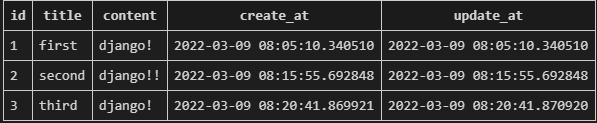

```
save를 하기 전에 해야 할 작업들이 있는 경우, 한 번에 save까지 하는 3번 방식이 불편할 수 있기 때문에 1,2번을 사용하는 경우가 많을 것

#자동으로 저장까지 해줌

In [28]: article = Article.objects.create(title='third', content='django!')

```

---

### ORM

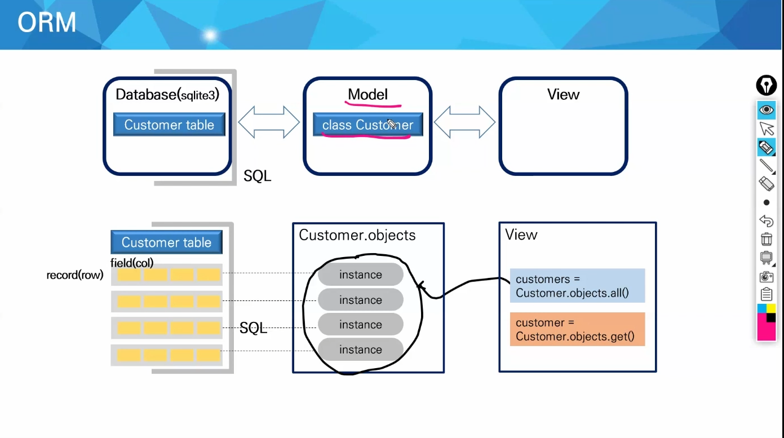

```
model에 Customer라는 class를 만들면, Database에 table이 생성됨
각 table에 data를 저장
개념적으로 우리 Customer(= class) 의 instance들이 각각의 record와 대응된다고 생각하면 된다. 각각 대응되는 instance들을 조작하는 것
기존에 table에 있는 데이터를 읽어 오면, 이게 클래스의 인스턴스로 우리에게 온단 말이지. 처음에는 우리가 생성을 하는 것. 
테이블에 있는 레코드에 대응하는 인스턴스를 얻어와가지고 (기존에 데이터가 있다면) 그 인스턴스를 받아와 조작하는 것
테이블 레코드에 대응하는 어떤 것을 가져옴(인스턴스로 우리가 넘겨받게 됨) 그 인스턴스에다가 각각의 필드에 대응하는 값을 변경을 하고 새로운 값으로 덮어 씌우는거지. 변경 수정을 하고 다시 DB에 반영하려면 save를 해서 반영
지금 우리가 ㅎ ㅏㄴ 것은 애초에 테이블에 데이터가 없으니, 빈 인스턴스를 만들고, 값을 설정하고, save를 진행하면 실제 테이블에 적용이 되는 것
수정을 하려면 이미 기존 테이블에 해당하는 프라이머리 키를 가지고 있는 인스턴스 값을 얻어와야함

save를 하지 않으면 나 혼자 이것저것 변경하는 것일 뿐 실제 테이블에는 나타나지 않습니다 ^^

인스턴스명이 article로 동일한데 어차피 키로 구분하니까 그런건가요?
==> 변수에다가 덮어서 계속 사용한 것. 코드로 쭉 있다고 한다면, 인스턴스를 저장하는 변수명에다가 새로운 것으로 덮어 씌운 것. 위에서 썼던 변수를 계속 사용하는 것

```

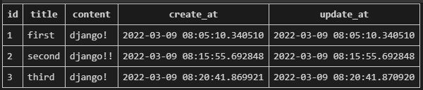

```
method를 추가 하는 것은 migration을 할 필요가 없음
```

```
class 내부에
	def __str__(self):
        return self.title
추가 후 

#종료 후 재시작해야지 method가 포함됨
In [29]: quit

#다시 시작
(venv) 
kim@DESKTOP-C4CL4DP MINGW64 ~/Desktop/ssafy/Django/webex_0308
$ python manage.py shell_plus

# 포함되어 있는 것들 보여주랑 
In [1]: Article.objects.all()
Out[1]: <QuerySet [<Article: first>, <Article: second>, <Article: third>]>
```


---

## READ

### all

```
쿼리셋을 유사 리스트라고 표현한 이유 : 저장하면 인덱스 접근, 슬라이싱 가능

Article.objects.all : 테이블에 있는 모든 정보들(레코드)들을 대응(참조)하는 article instance들의 list를 나에게 준다

In [2]: article = Article.objects.all()

In [3]: article[0]
Out[3]: <Article: first>

In [4]: article[1:]
Out[4]: <QuerySet [<Article: second>, <Article: third>]>

그럼 for문도 가능한가유? ㅇㅇ
In [7]: for a  in article:
   ...:     print(a.title)
   ...: 
first
second
third
```

---

### get

```
query set을 리턴하는 api가 아님
딱 하나의 instance에 대한 참조를 return해주는 것
search 했을 때 결과가 단 !! 1개 !! 일 때에만 return해주도록 매개변수 값을 넣어줌
그래서 항상 primary key를 주고 얻어올 때 쓰는 api method임
중복되어 있거나, 없으면 안됨
```


```
만약 여기에서 id값이 4인 걸 가져오라고 한다면?
 Article.objects.get(pk=4)
DoesNotExist: Article matching query does not exist 
(pk 값이 4인 애는 없어 미안 ㅠㅠ)

만약 3을 가져오라고 한다면?
In [9]: Article.objects.get(pk=3)
Out[9]: <Article: third>

만약 content 값이 'django!'인 친구를 불러달라고하면?
In [10]: Article.objects.get(content='django!')
MultipleObjectsReturned: get() returned more than one Article -- it returned 2!
(어? 내가 찾아보니까 값이 2개가 있엉 ㅠㅠ 난 모르겠는뎁 .. 난 하나만 리턴해줄 수 이써 ㅠㅠ)
```

---

### filter

```
queryset을 return해줌
1개든, 0개든, 여러개든 상관 없음
```


```
만약 content 값이 'django!'인 친구를 불러달라고하면?
In [11]: Article.objects.filter(content='django!')
Out[11]: <QuerySet [<Article: first>, <Article: third>]>

만약 값이 없는 친구를 불러달라고  한다면?
In [12]: Article.objects.filter(content='djangodfds!')
Out[12]: <QuerySet []>
=> 오류가 아닌 빈 리스트가 나온다
```

---

## UPDATE

- 새로운 걸 추가하는 것이 아닌 원래 값을 수정
- 수정을 위해서는 특정 record를 가져와야  함


< 변경전 >

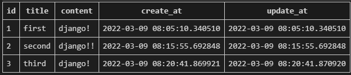

< 변경후 >


```
id값이 1인 친구를 가져와서 title을 바꾸고 싶어

In [13]: article = Article.objects.get(pk=1)

In [14]: article.title
Out[14]: 'first' => 현재 article의 title

In [15]: article.title = 'byebye!'
=> 변경해주기

In [16]: article.title
Out[16]: 'byebye!'
=> 인스턴스만 바꿔놨지 실제 DB에는 바뀌지 않은 상태

In [17]: article.save()
=> 바꾸기 위해서 save 해주기
```


---

## DELETE

```
특별히 할 건 없고 delete 그대로 사용하기!
delete의 return값은 삭제된 인스턴스 그대로를 보여준다.

delete를 하고 다시 찾아보면, 값이 매칭되지 않아 오류가 나옴
```

< 변경 전 >

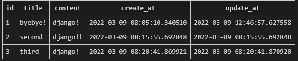

< 변경 후 >

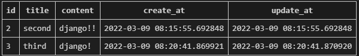

```
In [18]: article = Article.objects.get(pk=1)

In [19]: article.delete()
Out[19]: (1, {'articles.Article': 1})

==> 물론 Article.objects.get(pk=1).delete() 해도 됨
```

```
쿼리셋을 불러와서 한 번에 동시에 지워줄 수 있음
삭제된 정보를 return value로 제공함
```


---


일치하는 경우에는 (pk=xx) or (content=xx) 로 표현

하지만 다를 경우에는  __ 사용( _ * 2)

사용 예시

```
Article.objects.filter(pk__gt=2) => 문자열이 2보다 큰 경우 리턴해주세요
Article.objects.filter(content__contains='ja')
=> content에 ja가 들어가있으면 다 리턴해주세요(부분 조건 같이 ja와 완벽하게 똑같은게 아닌, ja가 들어가면 ㅇㅋ)
```


```
ex)
In [20]: article = Article.objects.get(pk=2)

In [21]: article
Out[21]: <Article: second>

In [24]: Article.objects.filter(content__contains='ja')
Out[24]: <QuerySet [<Article: second>, <Article: third>]>

(이외에도 startswith, endswith 등을 쓸 수 있음)

내 궁금증
그냥 연속되는 문자 두 개가 아니어도 가능할까? 안됨
In [25]: Article.objects.filter(content__contains='jo')
Out[25]: <QuerySet []>

그럼 문자열 두 개를 넣는 건 될까? 됨
In [29]: Article.objects.filter(content__contains='j'and'o')
Out[29]: <QuerySet [<Article: second>, <Article: third>]>
```

---

# !!시험!!

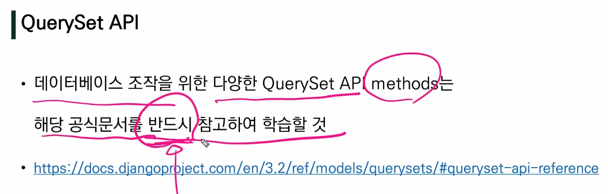

---


# Admin Site 

```
첫번째 시간에 잠깐 언급이 되었는데,
로컬호스트 후 /admin 치면 나오는 사이트에 로그인을 안했었는데, 그 계정을 만들어서 들어가 볼 것
admin사이트에 우리가 만든 클래스를 등록을 해서(우리가 만든 테이블)을 우리가 사용할 수 있음
DB의 기본적인 수정, 삭제, 생성 같은 것들을 해볼 수 있는 기본적인 인터페이스를 admin 사이트가 제공
따로 만들지 않아도 콘솔에서 하는 건 불편하니까, 브라우저에서 우리가 흔히 쓴느 인터페이스를 제공하는게 편하니까
```

##### 1.관리자 계정 생성

```bash
$ python manage.py createsuperuser
Username (leave blank to use 'kim'): admin
Email address: 
Password: 
Password (again):
This password is too short. It must contain at least 8 characters.
This password is entirely numeric.
Bypass password validation and create user anyway? [y/N]: y
Superuser created successfully.
(venv) 

#password : 
# 너무 짧은데, 영어도 없는데 계속 진행하겠냐는 질문에 y라고 대답한 것!
# password 창에는 비밀번호를 칠 때 아무 변화가 없음(그냥 계속 가만히 있음) 전통적으로 그랬음 주의하세요!
```

###### 1-1 확인해보기

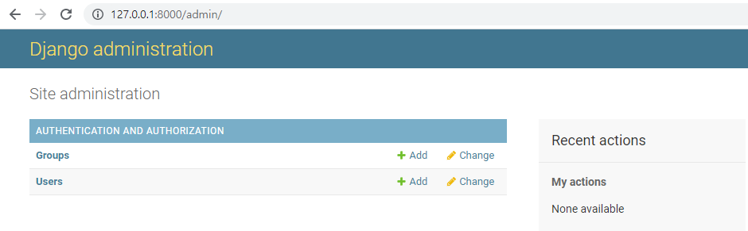

```
$ python manage.py runserver > http://127.0.0.1:8000/admin/ > id에 admin, pw에  입력
```

```
보이는 것
두 개의 table이 기본적으로 보임
```

1)users

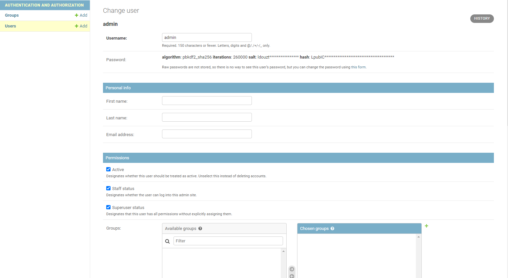


```
비밀번호는 암호화 되어있음을 알 수 있음
```

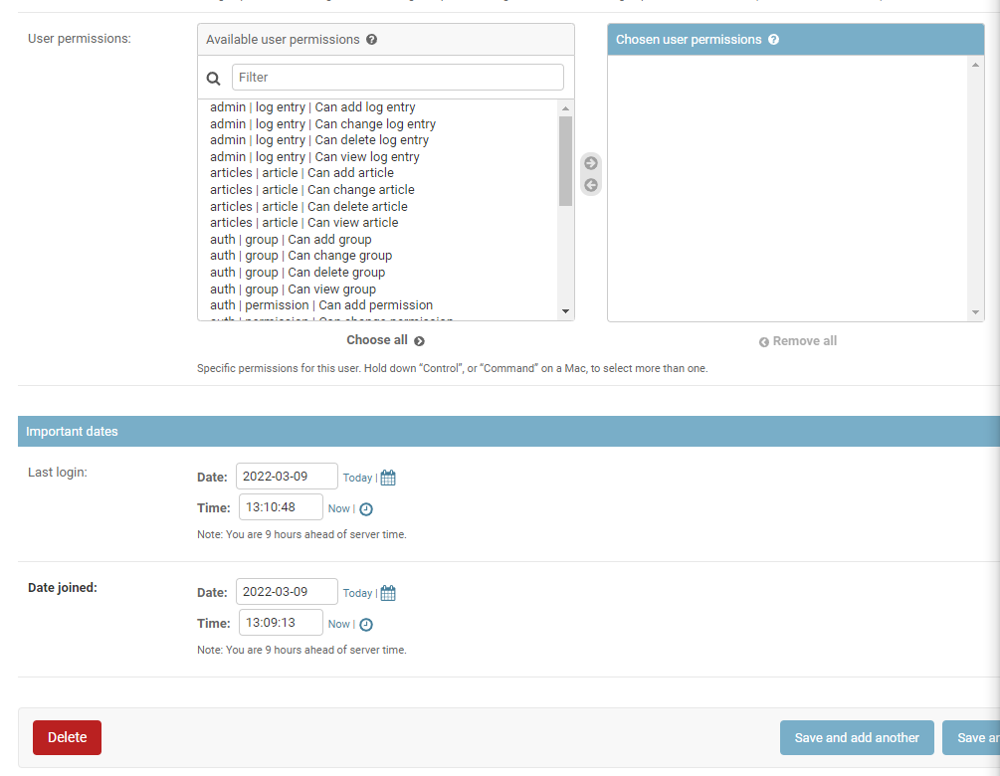

```
권한 수정, 방문 일짜, 삭제 가능
```

내가 만든 record(==table)을 보기 위해서는 app file > admin.py에 작성하여 Django 서비스에 등록

###### 주의! auth에 관련된 기본 테이블이 생성되지 않으면 관리자 계정을 생성할 수 없음  (auth_user table에 저장되어 있는지 보기)

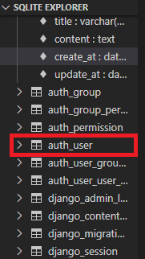

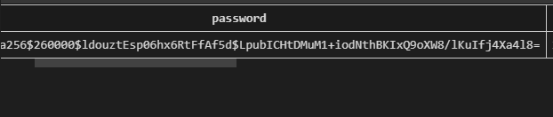

이런식으로 


##### 2.admin 등록

```
articles > admin.py
```

```python
#원래 있던 from
from django.contrib import admin

#현재 폴더의(.) models.py에서 Article을 불러오기
from .models import Article
# Register your models here.

#site라는 속성, 변수 // 정해져 있는 툴
admin.site.register(Article)

#site 라는 변수는 site = DefaultAdminSite
#DefaultAdminSite => 또 안에 뭐가 되게 많 ㅎㅎ
```

등록 후 admin 새로고침 하면

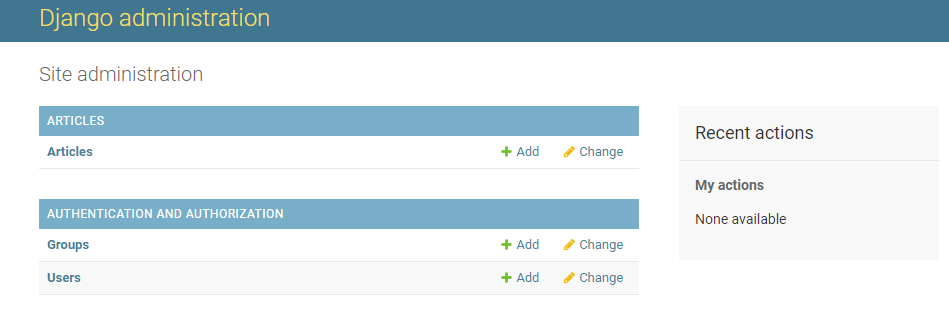

```
Article이라는 내가 만든게 있음!
클릭해서 들어가보면
```

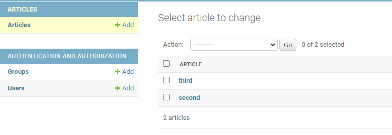

```
return 해준 table title이 보이는 것! 
이걸 클릭해보면
```

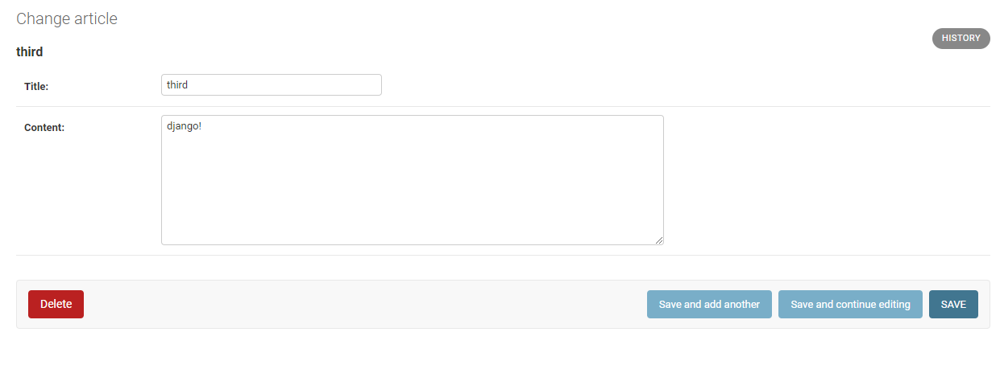

```
이곳에서 수정, 삭제 가능
여기서 thrid, second로 보이는 이유는 
아까 models.py에서 지정한
    def __str__(self):
        return self.title
이 부분 때문!
만약 없다면
```

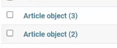

```
설정 전 primary key를 포함한 값이 나옴!
이렇게 보기가 좀 지저분해 보이니까 알아보기 쉬운 형태로 보여주고 싶다면 위 함수를 작성해서 보여주기(문자열을 만들면 된다~)
```


##### list_display

여러개의 필드를 다 보여주거나, 몇 개의 목록을 뽑아서 보여주고 싶엉 ..

=> list_display 사용 == 일종의 재정의

```
ModelAdmin을 상속 받는 어떠한 class를 정의

list_display 속성 넣어줌 > 문자열로 튜플 혹은 리스트(=iterable한 형태) 형태로 적어주기

(내가 article class에서 보여주고 싶은 field 이름을 적어서 넘기면, 이 field들의 내용을 table 형태로 보여준다.)

그리고 register할 때 Article 뿐 아니라 새로운 class도 넣어줌
```

< 설정 후 >

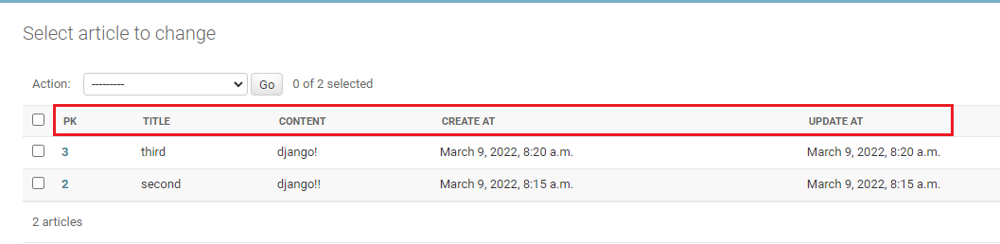

###### 사용방법

```
articles > admin.py
```

```python
from django.contrib import admin

#현재 폴더에(.) models.py에서 Article을 불러오기
from .models import Article
# Register your models here.

#ModelAdmin을 상속 받는 어떠한 class를 정의
class ArticleAdmin(admin.ModelAdmin):
    #list_display 속성 넣어줌 > 문자열로 튜플 혹은 리스트(=iterable한 형태) 형태로 적어주기
    list_display = ('pk', 'title', 'content', 'create_at', 'update_at',)


admin.site.register(Article, ArticleAdmin)
#그리고 register할 때 Article 뿐 아니라 새로운 class도 넣어줌

#==> 윗 줄에 list_display를 통해서 줄이 생김!
```

##### list_filter (create_at을 설정한 경우)

```
list_filter = ('create_at')
```


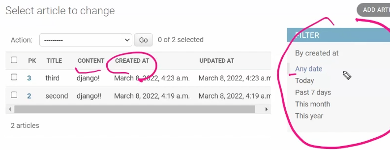

```
오른 쪽에 Filter 생성된 거 확인!
```

##### list_display_links

```
list_display_links('title')
```

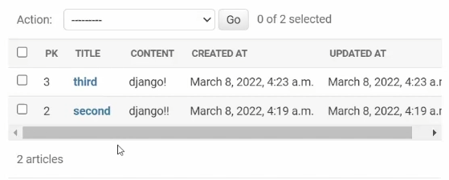

```
title에 링크가 걸린다~
!! 주의 !! links는 list_display에 들어가 있는 애들 중에서만 사용 가능~!
```


---

# CRUD with views

###### 오늘의 핵심!

```
shell_plus에서 했던 것들을 실제로 view 함수에다가 하는 것 ! (html 파일을 만들어서)
아까 admin 사이트에서 봤던 것들을 우리가 만들어 보는 것
simple하게 예쁘진 않지만, 우리 나름대로의 admin site를 만드는 것(table의 template를 만들고, data 생성 , 수정, 삭제)
우리가 따로 만든다는 것 -> 저 admin사이트에 있는 것은 table에 대해서만 동작하는데, 우리가 실제 앱을 만든다면 다양한 여러가지가 추가되겠죠
그 안에 핵심적으로 DB와 연결되는 부분은 지금 admin사이트에서 보여주는 것들과 별반 다를바가 없다
결국 DB와 연관되는 파트는 (사실 우리가 지금 계속 폼 양식 입력해서 보내고 데이터를 받고 여러가지를 하고 있기 때문에) 우리가 처리해야 할 수 있어야 함
```


##### 1.base.html 생성하기

```
최상위 directory > template folder 생성

project(현재 crud폴더) > seetting.py >         'DIRS': [BASE_DIR / 'templates',], 추가

templates > base.html
```

###### 1-1 base.html

```html
<!DOCTYPE html>
<html lang="en">
<head>
  <meta charset="UTF-8">
  <meta http-equiv="X-UA-Compatible" content="IE=edge">
  <meta name="viewport" content="width=device-width, initial-scale=1.0">
  <link href="https://cdn.jsdelivr.net/npm/bootstrap@5.1.3/dist/css/bootstrap.min.css" rel="stylesheet" integrity="sha384-1BmE4kWBq78iYhFldvKuhfTAU6auU8tT94WrHftjDbrCEXSU1oBoqyl2QvZ6jIW3" crossorigin="anonymous">
  <title>Document</title>
</head>
<body>
  

  <div class="container">
    
    
  </div>


  <script src="https://cdn.jsdelivr.net/npm/bootstrap@5.1.3/dist/js/bootstrap.bundle.min.js" integrity="sha384-ka7Sk0Gln4gmtz2MlQnikT1wXgYsOg+OMhuP+IlRH9sENBO0LRn5q+8nbTov4+1p" crossorigin="anonymous"></script>
</body>
</html>
```

```
! > cdn > js > div class='container' > block content
```


##### 2.index 페이지 작성(articles > articles.urls)

```
app_name을 등록하게 되면 반드시 app_name을 붙여서 url을 써야함. (return ('articles/index.html'))
```

```
crud(project) > urls.py >

from django.contrib import admin
from django.urls import path, include
#include 추가

urlpatterns = [
    path('admin/', admin.site.urls),
    path('articles/', include('articles.urls'))
]
# 두번째 path 추가

articles(app) > urls.py 추가 > 
```

###### articles > urls.py

```python
from django.urls import path
from . import views

urlpatterns = [
    path('', views.index, name='index'), #name은 탬플릿에서 상대적 url을 만들어주기 위해서 이름을 붙임!
]
```

###### articles > views.py

```python
from django.shortcuts import render

# Create your views here.
def index(request):
    return render(request, 'articles/index.html') #이름이 같은 경우 문제가 생기니까, templates 폴더 안에 app 이름으로 추가 경로를 추가해서 헷갈리지 않게 설정
    #앱 이름의 path를 추가해주는 것.
    
#그 이후 articles > templates 폴더 생성 > 그 내부에서 articles 라는 폴더 생성 > index.html 추가
```

###### index.html

```html



  <h1 class="text-center"> Articles </h1>
  <hr>

```

< 현재 상황 > 

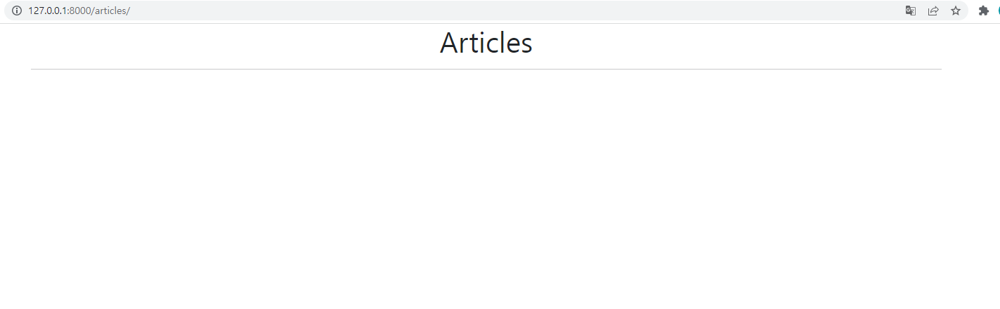

#### READ

###### articles > views.py

```python
from django.shortcuts import render
from .models import Article
# Create your views here.
def index(request):
    articles = Article.objects.all()
    context = {
        'articles' : articles,
    }
    
    return render(request, 'articles/index.html', context) #이름이 같은 경우 문제가 생기니까, templates 폴더 안에 app 이름으로 추가 경로를 추가해서 헷갈리지 않게 설정
    #앱 이름의 path를 추가해주는 것.
```

###### index.html

```html



  <h1 class="text-center"> Articles </h1>
  <hr>
  
  
    <p>글 번호 : {{ article.pk }}</p>
    <p>글 제목 : {{ article.title }}</p>
    <p>글 내용 : {{ article.content }}</p>
    <hr>
  

```

< 현재 상황 >

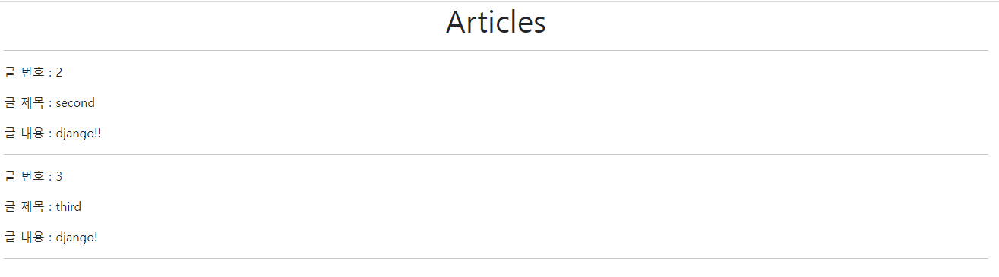


---


#### CREATE


