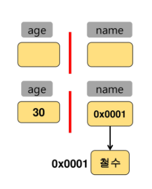

# 0403 JAVA 3

#### 자바 출력해보기 

```java
package prj01;

public class test {
//	main쓰고  ctrl+space -> 자동완성
	public static void main(String[] args) {
//		이 괄호가 우리가 프로그램을 작성할 명령어들을 작성할 부분
		System.out.println("Hello World");
//		syso 작성 -> ctrl+space시스템의 꾸러미에서 나가는 것을 명령어로 표현하는 것
//		실행은 ctrl + F11 / run 버튼 누르기
//		두줄 출력은 println (ln = line next = 줄바꿔주기)
//		그냥 출력에 바꾸고 싶다면 파이썬 줄바꾸기와 동일 (\n) / \"(") / \\ (\) / ' 표현 시에는 "'"으로 표현 가능하다
//		주석은 작업지침에서 열외 (ctrl + / -> 한 줄 주석)
		/*
		 * 이건 여러 줄 주석 * 와 /
		 * 주석 여러줄을 할 수 있는 단축키 : 원하는 라인을 드래그 한 후 ctrl + shft + c
		 * 정렬은 ctrl + shft + F (전체 드래그 혹은 전체 드래그 하지 않고)
		 * */
		
//		정수 표현 %d (정수 포맷)
		System.out.printf("%d \n", 10); //정수(10진수)
		System.out.printf("%o \n", 10); //정수(8진수)
		System.out.printf("%x \n", 16); //정수(16진수)
		
		
		System.out.printf("%4d \n", 10); //4칸 확보 후 오른쪽부터 차지(총 자릿수가 4칸, 오른쪽부터 수가 들어가니까 두 칸이 비워지고, 10이 채워짐)
		System.out.printf("%-4d \n", 10); //4칸 확보 후 왼쪽부터 차지
		System.out.printf("%04d \n", 10); //4칸 확보(0으로) 후 오른쪽부터 차지
		
//		실수 표현하기 : f 사용하기 (n번째 소숫점까지 표현하고 싶다면 %.nf)
		System.out.printf("%f \n", 10.1); //실수
		System.out.printf("%.2f \n", 10.1); //실수(소숫점 둘째자리까지)
		
//		문자열 표현하기 : s 사용하기
		System.out.printf("%s \n", "김애리"); //문자열
		
//		혼합하여 표현하기
		System.out.printf("%s의 나이는 %d 입니다. \n", "김애리", 26); // 문자열이 s로 찾아가고, 숫자가 d로 찾아가기 


	}
}
```


#### 변수

##### 정의

- 데이터를 저장할 메모리의 위치를 나타내는 **이름**

```
주소에 해당하는 이름을 기억 (주소를 직접 기억하기에는 번거로우니까)
```

- 메모리 상에 데이터를 보관할 수 있는 공간을 확보
- 적절한 메모리 공간을 확보하기 위해서 변수의 **타입** 등장

```
변수를 사용하는 문법에는 이름과 타입이 꼭 필요하다. 
타입 : 어떤 크기로, 어떤 규칙으로 존재하는지
```

- '='를 통해서 CPU에 연산작업을 의뢰


##### 메모리의 단위

- 0과 1을 표현하는 bit
- 8bit = 1byte



```
내가 확보한 공간에다가 데이터를 그대로 넣는 것 : 기초 자료형
데이터는 다른 곳에 있고, 공간에다가 데이터가 저장되어 있는 위치를 저장하는 것 : 참조 자료형
```

###### In JAVA

```java
		int a; //선언
		a = 10; //10을 a라는 변수에 저장
		System.out.println(a); //변수는 값을 할당하지 않고서 사용할 수 없습니다
		int b = 20; // 선언과 동시에 초기화하는 방법
		System.out.println(b);
		int c = a; //오른쪽 변수의 값을 꺼내서 왼쪽 변수에 담는다
		System.out.println(c);
		c = b; //이렇게 중간에 변경도 가능하다
		System.out.println(c);
```


##### 선언

1. 자료형 변수명;
2. 예) int age;    //    String name; ...


##### 초기화

1. 변수명 = 저장할 값 ;
2. 예 ) age = 30 ;    //    name = "철수";


##### 선언과 초기화를 동시에

1. 자료형 변수명 = 저장할 값;
2. 예 ) int age = 30;


##### 변수의 특징

- 대소문자를 구분한다
- 공백은 허용되지 않는다
- 숫자로 시작할 수 없다
- '$'와 '_'를 변수 이름에 사용할 수 있다. 이외의 특수문자는 허용하지 않는다
- 예약어(keyword)는 사용할 수 없다
- 예약어(keyword)란 자바 문법을 위해서 미리 지정되어 있는 단어를 의미한다. 이에 포함되어 있는 단어들은 변수의 이름으로 사용할 수 없다. (int는 변수로 설정 할 수 없음)