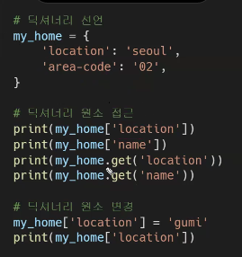
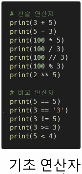
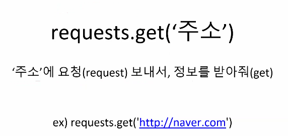
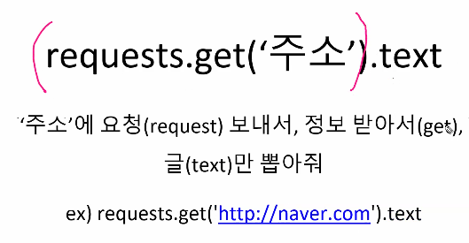
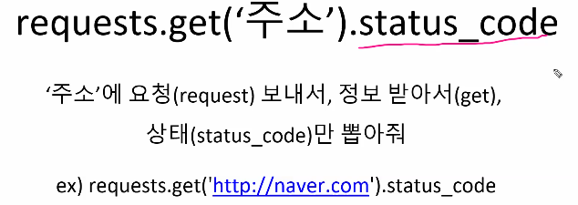
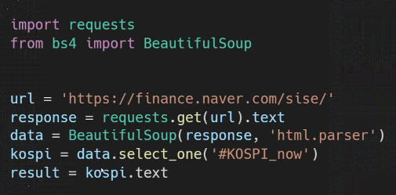

실시간 데이터를 필요로 하기 때문에

데이터 수집이 필요함


파이썬 과정 트랙에서 배워서 적용해서 해보는 게

데이터를 얻어오는 것


데이터를 제공하는 곳에서

데이터를 가져와서

처리해서 오는 것


경험해보는게 스캠때 해볼건데

많이는 하지 못할 듯


나중에 다 할거니까 걱정하지 말기


아쉬워 할 필요는 없음


다 주석처리 하고 싶으면 ctrl+/


## 파이썬 기초

#life is short

컴퓨터

프로그래밍

언어


기술을 사용하기 위한, 결과물을 만들기 위한 기초 학습.

코딩을 하려면 프로그래밍 언어가 필요하다

컴퓨터와 소통 (서로 이야기)


기본적으로 코딩을 하려면 프로그래밍 언어가 필요함

다양한 언어가 있지만 우리는 파이썬


컴퓨터 프로그래밍 언어 == 컴퓨터에게 무언가를 시킬 때 쓰는 말

컴퓨터 프로그래밍 언어 : 원래는 좀 어려웠다 (c언어같은 경우는 쓰기 복잡,어려움)

C 이후에 나온 프로그램, 개발에 대한 패러다임이 바뀌면서 객체지향 언어 ,

스크립트가 발전하며 조금 더 쉽게 쓸 수 있는 언어들이 나타나게 됨.


컴퓨터가 이해하는 언어? 

컴퓨터는 hw이기 때문에 사실 이해한다거나 하지 않음


c언어 (컴파일 랭귀지)

인간이 이해하기 쉬운 형태로 작성한 후 기계가 이해하기 쉬운 상태로 바꿔줘야 함

언어마다 한계가 있음

범용언어(C,C++,JAVA) - 사용할 수 있는 분야가 많은 언어들.

컴파일을 안하고 코드를 작성해서 바로 실행시킴

프로그램이 프로그램을 실행시킴 

한계가 있을 수 밖에 없음 (언어적 특성 때문에)

예전에는 나름 한계가 있었는데 나름대로 극복을 하고 있어서 범용언어처럼 성장중이다!

---

python은 

1. 대소문자 구별을 합니다
2. 띄어쓰기 제대로 해야함
3. 스펠링

파이썬 확장자는 뒤에 .py

python의 문법

1. 저장

   - 저장의 개념은?
   - 공간에다가 값을 저장 (=이라는 표현을 씀)
   - 우변을 좌변에 저장 ( a = 10 이면 10을 a에 저장 / 10은 값이고 a는 저장공간)
   - a는 10이다가 아니라 a에 10을 저장(할당)한다

   무엇을 저장하는가? -> 저장되는 값 / 유형이 있다

   1. 숫자 (현실세계에 존재하는 모든 숫자(글자가 들어가면 안됨) / 기본적 연산 가능)

      - (o)12/-365/3.14 (x)23ab,ba123

   2. 글자 (현실에 존재하는 모든 글자 / 따옴표로 둘러싼 글자 or 숫자)

      - '미세먼지', '58도 글자입니다' '글자는 반드시 따옴표를 붙여야 합니다!'
      - '58'은 숫자가 아닌 글자임! (숫자 58 표현하고 싶다면 따옴표 제거)

   3. 참 / 거짓

      - True or False 단 두 가지 표현 가능

      - ##### <u>조건 / 반복에 사용됨</u>

      (300>200 => True // 150 == 300 => False)

      

      # 어떻게 저장하는가?

      어떻게 저장하는가?

      1. 변수

      - 저장된 값을 변경할 수 있는 박스
      - 숫자, 글자, 참&거짓을 담을 수 있다.

      ```
      dust = 58
      dust = 60
      print(dust)
      
      실행값 : 60
      (덮어씀)
      ```

      ```
      dust = 60 => 변수(바뀔 수 있음)
      input = '미세먼지' => 값 (저장되어 있음. 불변)
      
      print(hello) => ''이 없음. hello는 변수. 그 앞에 hello에 대한 값을 저장해야 함.
      
      print('hello') => hello라는 값을 출력
      ```

      개발자는 프로그램 실행이 될 때마다 그때그때 달라질 수 있음을 알아야함

      내가 코드를 작성할 때 키보드로 입력을 받아서 입력으로 들어온 값을 가지고 프로그램을 실행되게 하려면

      값이 아직 결정되지 않은 상태

      사용자가 키보드로 입력을 하면 그 값을 박스에 담아놓고, (어떤 값인지 모르니까) 그 값을 쓰려면 그 값에 대응하는 다른 값을 주어야함. 그게 박스 name 같은 거임.

      그 값이 나는 뭔지 모르겠지만 박스에 저장되어있을 테니 나는 이름을 붙이겠다!

      변수는 있을 수 밖에 없음 (상수로만 진행한다면 늘 같은 값이 나올테니까)

      주어지는 값에 따라서 그에 맞는 결과를 출력해 낼 수 있겠죠

      공간에 대한 개념이 필요함

      

      100개의 변수를 저장하려면 100개의 변수를 저장해야 한다.

      1000개 10000개를 만들라고 하면? 아무도 안하겠지 ~

      

      2. 리스트(list)

      동일한 성격의 data를 일일히 저장하기 싫어. 더 편한 방법은 없을까?

      => 박스들을 붙이자

      

      여러개의 값을 저장할 때, 넘버링은 무조건 **0** 부터!

      여러 값을 저장할 때, 제일 마지막 값은 항상 전체 갯수보다 1 작음(0부터 세니까)

      

      박스의 리스트(리스트)

      박스가 순서대로 여러 개가 붙어있다.

      ```
      dust = [58, 40, 70]
      print(dust[1]) => dust 값들 중에 [1]에 할당하는 변수를 보여줘!
      
      값 : 40 (0부터 세기 때문에 [0]=58 , []값을 안적으면 셋 다 출력)
      ```

      list는 중간에 끼워 넣을 수도, 제거, 변경, 추가 가능함 

      빈 박스들의 리스트 (아예 빈 리스트) => dust = []

      

      다른 언어들에선 변태라고 볼 수있지만

      파이썬은 각 박스에 넣는 값이 종류가 달라도 가능함.

      (숫자, 문자 등 여러 종류의 값들을 저장 가능함. 심지어 박스 리스트도 담을 수 있음)

      => 니가 상상하는 모든 걸 다 담아줄 수 있어! 일단 담아봐! 맛만 봐!

      다른 컴파일 언어들은 쉽지 않고, 어려움

      

      ! list보다 더 편한 방법은 없을까?

      => 견출지를 붙여 보자!

      여러 개의 묶음에 넘버링을 부여한 걸 사용했는데, 그게 번호가 아니라

      우리가 이해하기 쉬운 어떤 단어같은 걸로 박스를 구분하는 것

      3. 딕셔너리(dictionary)

      - 궁극의 박스 dictionary

        "견출지 붙인 박스들의 묶음"

        

      ```
      dust = {'영등포구':58, '강남구':40} -> 영등포구:58 페어로 저장
      첫 '영등포구' 위치 단어를 key , 뒷 '58' 위치 단어를 value(값)으로 표현.
      검색을 하기 위한 key(구분을 위해)
      key값은 같은 값을 쓰면 안된다! 같은 key를 쓸 수 없음 (기본적으로)
      원래 여러개의 데이터를 list로 저장했으면, 부여된 숫자를 찾아야하는데
      dictionary로 저장하면 저장한 키값을 쓰면 바로 찾을 수 있음.
      (굉장히 powerful한 언어이기 때문)
      print(dust['영등포구])
      ```

      

      알고리즘 풀 때 가장 많이 쓰는 건 = list

      

      

2. 조건

```
if True:
	print('조건문입니다.') <- if의 영향을 받는 것들은 이렇게 들여쓰기 해야함!
```

순차적으로 진행되는 과정에서 '조건에 부합하면 진행하라.'라고 알려주는 것

`if`라는 키워드로 진행함.

```
if <조건-변수일 것임(만족 하냐 안하냐를 들어가려면 변수가 들어갈 수 밖에 없음)>
<수식_변수들의 값을 가지고 계산하는>

if는 두 가지 경우를 만족시킬 수 있음
-> 1) if <조건을 만족할 때> or <조건을 만족하지 못할 때> (=> T or F)
```


프로그램 실행 흐름<순서도>


알고리즘 수업에서 이야기 하겠지만 , 알고리즘 = 일의 순서, 흐름이라고 할 수 있음.

텍스트로 하면 보기 힘드니까 보기 용이하기 위해 수식, 순서도를 활용

```python
순서도를 파이썬으로 표현한다면
if dust > 50:
	print('50 초과')
else:
	print('50 이하')
```

타 언어들은 표시하기 위해서 {}를 사용하지만, 파이썬은 중괄호를 사용하지 않음.

대신 들여쓰기를 사용함 (tap키 혹은 space*4)

들여쓰기 -> 윗 줄의 영향을 받는 경우, 들여써야 한다 (굉장히 중요함)

```python
dust = 60
if dust > 50:
	print('50 초과')
else:
	print('50 이하')
	
결과 : True -> 50 초과 출력
40일 경우 -> False -> 50 이하 출력
```


# 조건

if/elif/else


```python

elif (else if 줄임말)
조건문이 끝낼 때 세미콜론(;)이 아닌 콜론 (:) 사용

---------------------

if dust > 150:
	print('매우 나쁨')
elif 조건:
	print('나쁨')
elif 조건:
	print('보통')
else:
	print('좋음')
```


```
타언어는 30 < dust and dust <= 80:으로 표현하는데
파이썬은 80 < dust <= 150 처럼 범위 설정이 가능.
```


<교수님 코드>


<내코드>


3. 반복

컴퓨터는 멍청해! 정확하게 말하지 않으면 몰라잉!

if 나 elif, else, while 문 쓸 때에는 뒤에 콜론(:)

```python
while True:
    print('계속해주세요')
    
```

while 뒤에 값이 true면 계속 진행하는 것 (프로그램을 강제로 죽이거나, 조건에 맞지 않을 때까지)

`true` 위치 - 조건문
어떨때 쓰는가?
내가 원하는 만큼, 필요한 만큼만 반복하고 종료했으면 좋겠음

=> 결국 변수가 필요할 수 밖에 없음. 반복하는 동안 true였다가 필요 없을 때 false가 나올 수 있는 조건문을 적어놔야 하기 때문에, 변수가 사용될 수 밖에 없음


순서도와 텍스트문


```
처음 왔을 때 0.
0은 3보다 작기 때문에
첫 번째 출력: 1
'='은 저장하라는 것.
헷갈릴 수 있지만 =는 저장을 의미함.

n=n+1 이라면 n에 n+1을 넣으라는 것! 
변수 = 저장 공간을 의미 or 그 변수의 값 두 가지를 의미함.
좌변의 변수는 저장 공간을 의미
우변의 변수는 변수에 저장된 값을 의미함.
컴푸터는 정해진 순서에 의해서 계산을 진행.

저 텍스트문을 보면
언젠가는 종료해야 하기 때문에 n<3이라는 조건문을 닮
n이 가지고 있는 값이 계속 변경이 되면서 true -> false로 바뀌어야 종료함
바뀌는 n은 while문 안에 들어있을 수 밖에 없음
항상 조건식과 조건식이 들어가는 초기값이 필요함

실제로 반복하는 건 print(dust[n])이지만
반복 컨트롤을 하는 건 n=0, n<3, n=n+1임
```

#### for 반복문

for / while 사용 방법도, 환경도 다름

```
for i in List:
	print('정해진 범위 안에서 계속')
```

wile if는 수식, 값을 판단할 수 있는 것들이 나옴

for은 값이 정해져 있음

for을 쓰면 in은 따라올 수 밖에 없음

for in 사이에는 본인이 쓰고싶은 이름을 쓰는 것임

in 다음에 List 자리에는 (우선 list함수를 쓸 수 있음)


while문을 이용해서 넘버링을 써서 가져올 수 있음

list는 파이썬 내부적으로 list가 있으면 몇 개 있는지 알 수 있음

나는 여기 list안에 저장되어 있는 값의 크기만큼 반복하고 싶어 (갯수만큼)

list 안에 저장되어 있는 값을 하나씩 가져와서 그 값의 갯수만큼 일을 반복하고 싶어

for문에 의미하는게 뭐냐면

```
dust = [59, 24, 102]
for i in dust:
	print(i)
	
=> i = 59, print(59) / i = 24, print(24), / i = 102, print(102)
나는 dust에서 하나씩 가져와서 하고 싶어
그리고 그걸 i라고 이름을 붙여서 쓰고 싶어
하나씩 가져 올 때마다 for문 안에 있는 작업을 반복하고 싶어
for은 여러개의 묶음을 주고, 그 갯수만큼 하나씩 가져와서 일을 반복하고 싶음

==> while에서 작업하는 것을 for로 좀 더 심플하게 진행시키는 것
(일반적으로 list안에 있는 것들을 하나씩 가져오는 작업을 많이 하기 때문에 좀 더 쉽게 사용 가능)
물론 for문을 그렇게만 사용하진 않지만 많이 쓰인다~
```

```
while 조건
조건이 true인 동안 반복적으로 실행 되기에 종료조건이 반드시 필요하다.
(처음에는 true였다가 언젠가는 false가 되는 조건문이 필요함)

for i in dust:
정해진 범위를 반복하기에 종료 조건이 필요가 없다
```


---

# 함수

재사용 코드 덩어리

입력이 있고, 출력이 있다.


```
함수를 호출한 쪽에다가 결과를 옮겨주게 됨.
입력이 있으면 (input) 출력이 있음 (output)
function = 코드 덩어리
```

특정한 용도의 동작하는 코드를 한 곳에 모아 놓은 것.

- EXCEL 함수(function)

  - sum()
  - average()
  - count()

- Python 함수

  - Built-in Functions(내장 함수) 

    - print('hi')
    - abs(-3) => 3 (부호 변경)
    - len('hi') => 2 (length, 길이_size 알 수 있는 함수)
    - 그 외 내장함수들

    

  - Non-built-in functions - 기본적으로 내장되어 있진 않지만 쓰기 위해 사전작업을 해야함 (나 이거 쓸거니까 .. 사전작업좀 해조 ㅎㅎ)

python module 

-random

모둘 활용

1, 함수가 포함된 코드를 불러온다. (import) _ 나 이거 쓰고 싶으니까 이 모듈좀 가져올래?

2, 함수를 사용한다.


import random

```
random. 은 모듈임
랜덤이라는 모듈 안에 (random이라는  파이썬 함수라고 볼 수 있음)
random 안에 여러개의 함수가 있음
랜덤 모듈 안에 있다는 걸 표현하기 위해 (.) 표현
random.choice -> 랜덤이라는 모듈 안에(.) choice 함수를 쓰겠다.
random.sample -> 랜덤이라는 모듈 안에(.) sample 함수를 쓰겠다.
```


1)) random.choice() 

```
random.choice(리스트) -> 리스트 함 수 쓸 수 있음.
리스트에서 임의로(randomly) 하나의 요소를 선택(choice)

ex) random.choice(menu)
```


2)) random.sample()

```
random.sample(리스트, 원하는 갯수)
리스트에서 특정 수의 요소를 임의적으로(randomly) 비복원추출(sample)

ex) random.sample(numbers,6)
=> numbers 리스트 안에 있는 수들 중 6개 비복원 추출
```

```
1부터 45까지 쓸 때, 일일히 쓰기 싫어!
차례대로 쓸 수 있는 내장함수 range
range(a,b)
a=시작 숫자, b는 마지막숫자 +1을 해줘야함 (1부터 b-1까지 나타나게 함)
그래서 반드시 표현하고 싶은 마지막 숫자에 1을 더해주기!
```


# 파이썬 문법 맛보기

git- datatype.py에 저장되어있음

#### 값의 유형

```
숫자
number = 3
print(type(number))
type() = 괄호 안에 있는 함수가 어떤 명령어를 써야 하는 타입인지 알려줌

형변환
string_number = '3'
print(string_number + 5) <- 더하기 (이항연산자 _ 두 개의 연산자(왼,오)가 필요함)
+ 는 같은 형끼리 가능 (숫자+숫자, 문자+문자 // 숫자+문자는 안됨)
두 개의 자료형이 같아야지 덧셈이 가능함
근데 왼쪽 오른쪽 자료형이 다를 경우 -> 계산 못 함
컴퓨터는 가능하다면 한 쪽의 자료형을 다른 한 쪽의 자료형에 맞춰서 변환시킴 => 형 변환
내가 시키지도 않았는데 자료 변환시킴
프로그래머가 이 변수의 자료형을 봤더니 다른 자료형으로 바꿔가지고 쓰는게 좋겠다 -> 특정 자료값을 다른 자료형으로 의도적으로 바꿀 수 있음 (개발자가 변환하는 경우) -> 되는 경우가 있고, 안되는 경우가 있음

string_number가 문자로 저장되어있음 '3'(''이 있어서)
문자를 숫자로 바꾸고 싶으니까 print(int(string_number) + 5)로 변환
```

```
f-string
파이썬 고유의 특징
name = '홍길동'
print(f'{name}입니다. 반갑습니다') -> 문자열 출력을 할 때 쭉 나오게 하기
```

print(len(my_list)) -> len 함수 실행. 실행된 len값이 다시 print의 함수로 들어감.




```
딕셔너리 원소 접근은 위에 두 줄 or 아래 두 줄
차이점이 있긴 있음
키값을 다르게 줬을 때, 나타나는 양상이 다름
```

---


### 수식



```python
산술 연산자
3 + 5 = 8(덧셈)
5 - 3 = 2(뺄셈)
100 * 5 = 500(곱셈)
100 / 3 = 33.33(실수로 나옴)
100 // 3 = 33 (소수점 이하는 버려버림. 몫만 나옴)
100 % 3 = 1 (나머지를 계산해주는 연산자)
2 ** 5 = 2의 5승 (32)

--------------------------------------------------------

비교 연산자
 5 == 5 (같냐)
 5 != 5 (같지 않냐)
 3 >= 3 (같거나 크냐)
 5 < 4 (작냐)
```

```
c나 자바 경우 -> 정수끼리 계산하면 반드시 정수가, 실수끼리 계산하면 반드시 실수가 나옴
5/2를 하면 2.5가 아니라 2가 나옴 (실수가 나올 수 없음)
파이썬은 위와 다르게 무조건 실수가 나옴
5/2 를 하면 2.5가 나옴

정수와 실수가 다르게 분류하는 이유 -> 자료형이 다르고, 처리 방법이 다르기 때문
```


컴퓨터가 수행하는 가장 작은 단위의 수행작업 -> 연산자

컴퓨터는 수식을 만드들면 항상 하나의 값으로 만드는 작업을 진행함

그리고 그 값을 가지고 그 다음 단계를 실행하게 됨.

지금은 print라는 함수를 사용해 값을 사용하는데, 결국 그 함수값이 프린트 값으로 들어감

넓은 의미에서 보면 값 하나만 보는 것도 수식임. 어차피 값 하나로 떨어지는게 수식이기 때문

함수 호출을 써도 수식. 수식으로 판단

결과값을 하나 주기 때문에 수식으로 볼 수 있음.


---

# 프로그래밍을 통해 정보 수집하기

### 웹페이지 크롤링

web crawling

조직적, 자동화된 방법으로 웹을 탐색하는 것. (웹 페이지를 보는 것)

**검색 엔진**과 같은 여러 사이트에서는 데이터의 최신 상태 유지를 위해 웹 크롤링을 함.

1. naver에 들어간다 
2. 정보를 검색한다
3. 원하는 정보만 복사한다
4. 내 컴퓨터에 저장한다

```
https://search.naver.com/search.naver?where=nexearch&sm=top_hty&fbm=1&ie=utf8&query=ssafy
```

query=ssafy <- ssafy에 대한 탐색문


크롬이 주소에 대한 요청을 보내고, 그 응답 결과를 웹 화면으로 예쁘게 보여준다.

파이썬이 주소에 대한 요청을 보낸다.




```
요런 주소를 넣어줭!
```





```
그냥 요런 이름으로 저장되어있는 데이터가 있다! 
```





```
URL을 보낼 때
정상적으로 return : 200
알 수 없는 웹페이지에 대한 요청을 해서 난 못찾겠어! 를 return : 404
```

---


# 정보 스크랩

1. 정보가 있는 사이트 URL을 확인한다
2. URL로 요청을 보낸다.
3. 응답 결과에서 원하는 정보를 보낸다.

#### 정보 스크랩 1단계

```
1. 원하는 정보가 있는 주소로 요청을 보내, 응답을 저장한다.
import requests
reponse = request.get(url).test

2. 정보를 출력하여 확인한다.
print

파이썬이 그 응답 결과를 예쁘게 관리한다.
```


BeautifulSoup(문서)(모듈이라고 생각하기)

받은 문서를 예쁘게(사용하기 좋게, 추출하기 쉽게) 만들어줘

ex) data = BeautifulSoup(response)

```
from bs4 import BeautifulSoup

1)BeautifulSoup(문서) <- txt
2)BeautifulSoup.select(경로)
3)BeautifulSoup.select_one(경로)
```


.select(selector)

문서 안에 있는 특정 내용을 뽑아줘(select)

ex) data.select


.select_one(selector)

문서 안에 있는 특정 내용을 하나만 뽑아줘(select_one)

ex) data.select_one('정보경로')


파이썬이 주소에 대한 요청을 보내고(requests), 그 응답 결과를 예쁘게 관리한다(BS4)


원하는 값은 어떻게 찾을까?(KOSPI)




선택자

html에서 특정 위치를 표현하는 방법이 있음 ㅇ

원하는 특정 요소를 표현하는 방식이 있음.

우리가 copy selector를 한 이유 -> 저장 정보를 문서 안에서 나타내는 선택자를 알아온 것.

문서 안에 달라고 요청한 것

선택자는 HTML의 특정 부분을 가져오기 위해 사용한 것

그리고 BeautifulSoup이 구조화 해준 것!


크롤링 정리하기


