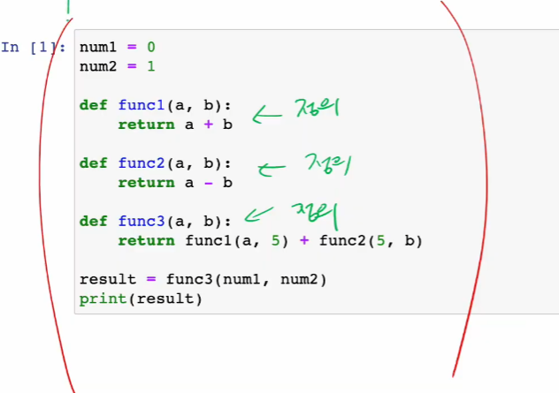
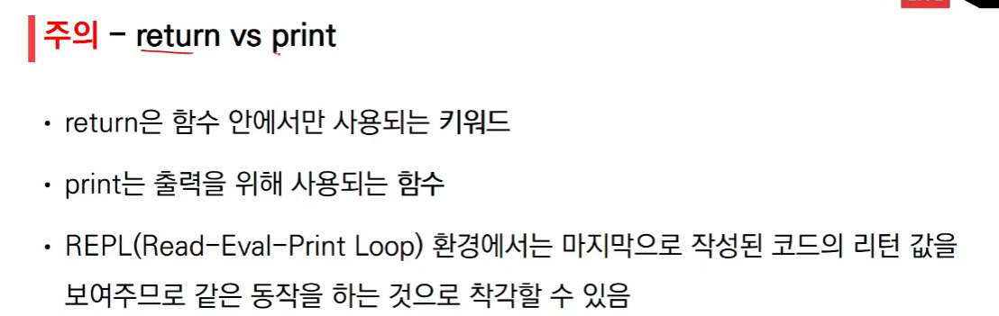
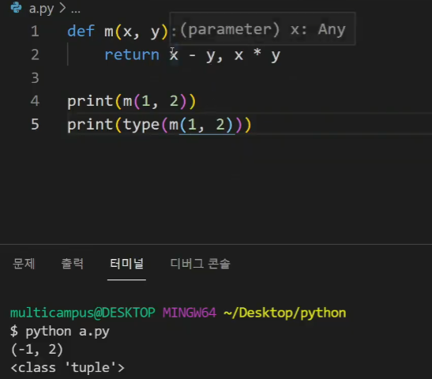
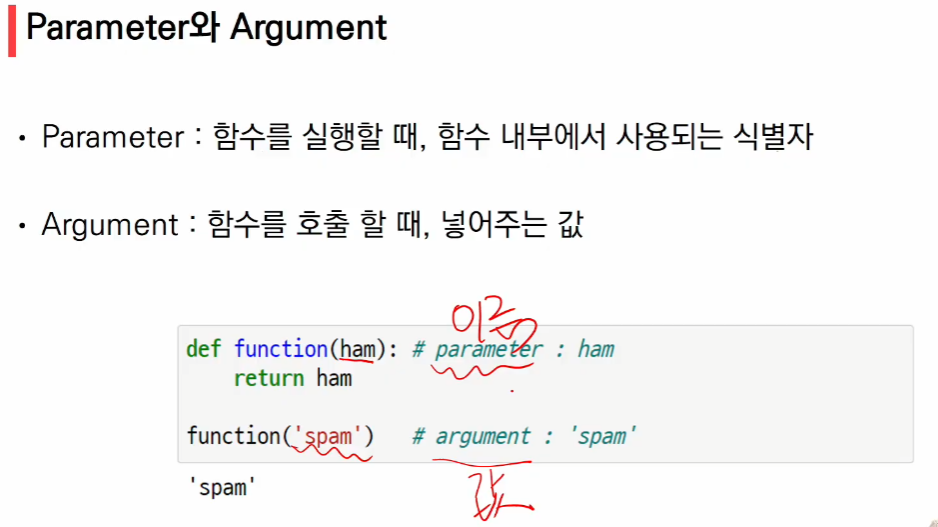
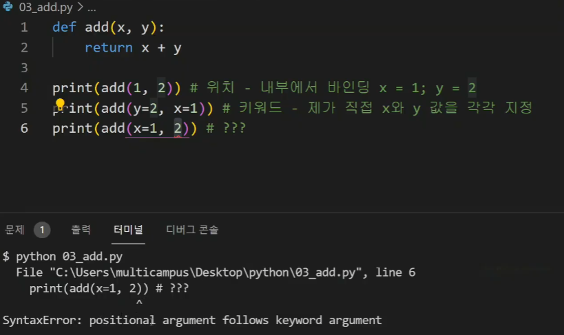
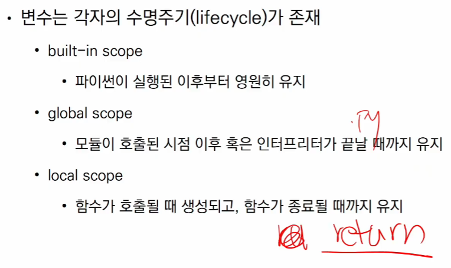
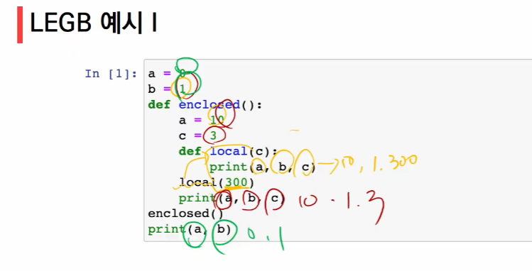
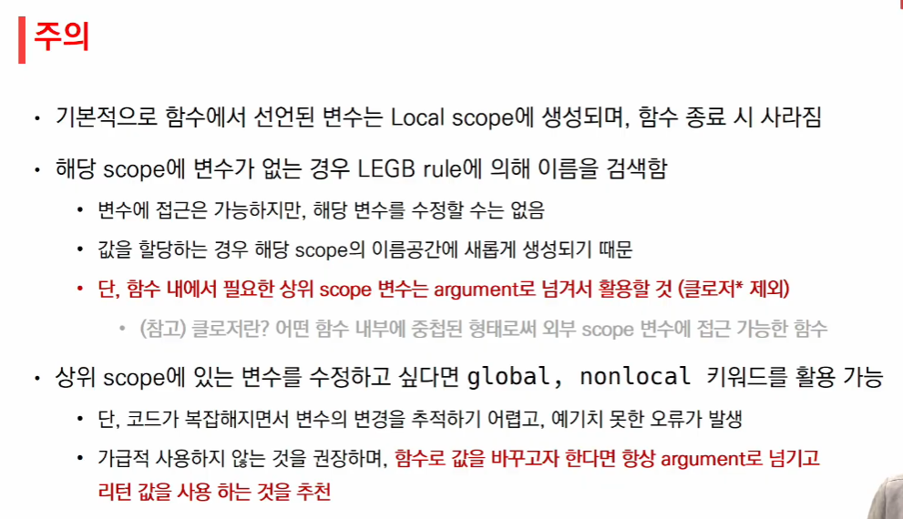
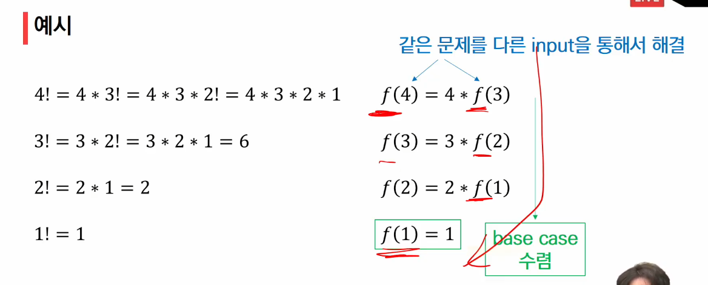
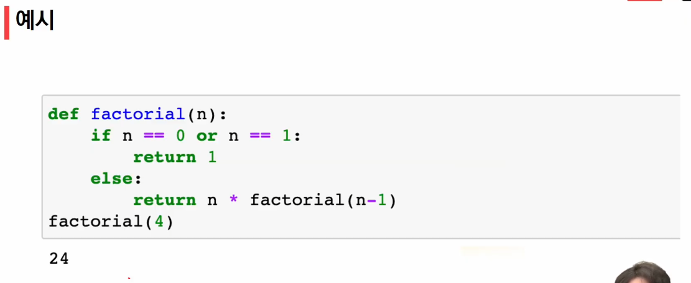

함수의 호출과 정의를 나눠서 생각할 필요가 있음.



```
지금 정의를 볼 필요는 없음. (def 파트)

읽는 순서
1) num1 num2 의 정의
2) result 값
3) 위로 올라가서 하나씩 보기
```



```
출력은 우리가 값을 보려고 하는 것!
좀 더 적극적으로 print와 return을 다르게 생각할 필요 ㅇ
```

```
return을 만나면 종료가 되므로
return 세 개가 있어도 첫번째 return을 작동한 후 사라짐~
리턴이 두 줄이면 (vscode에서는 자동으로 캐치해서 반환됨)

```



```
명시적인 return이 없는 경우 -> None타입 반환(값이 x)
명시적인 return이 있는 경우 -> 반드시 하나(하나의 객체)를 반환합니다. 그래서 얘는 무언가를 반환해준다~!
만약 위 사진처럼 연산 두 개를 같이 return한다? -> 튜플로 묶어서 하나로! 반환한다
```

---

```
parameter - 이름
argument - 값
```



```
argument : 호출 시 전달되는 값
argument
- 필수 argument : 반드시 전달되어야 하는 값
- 선택 argument : 값을 전달하지 않아도 되는 경우는 기본 값이 전달

```



```
Syntax error : positional argument follows keyword argument
=> 키워드로 지정하는 순간 위치가 이미 의미가 없다.
(첫 값을 그냥 1로, 둘째 값을 y=2로 지정하면 실행됨.)
위치 지정 .. 키워드(선택 파트 하고 알려줌)
=> 이미 지정하면서 위치를 망가뜨렸는데, 위치대로 하려니까 오류가 남~!


prind(add(1, y=2))가 되는 이유
=> 5개를 가지고 있는 함수 중 2개 필수, 3개 선택인 경우,
2개는 위치로 넣으면 편하겠죠(필수니까)
세 개는 선택임.
이 순간 선택 중에 원하는 걸 키워드로 쓰는거다. 
==> 뒤쪽에서 설명해줌
```

```
첫째, 둘째 줄은 온전히 실행되나
마지막 줄은 에러가 남
```

```
key와 default는 다름
key 는 키 값만 지정!
default는 기본값!!
default는 정의를 하고 있는 것
keword는 호출을 하는 것!
두 개를 헷갈리지 말기~!
```

```
보통 함수 정의할 때 필수 파라미터 위치를 앞에 둬야 하나요?

기본 인자가 없는 위치 인자는 항상 다른 것들보다 앞에 두면 된다!
```

```
만약 주려는 값이 너무 많다면
어떻게 비워둬야 할까?
==> * 로 표현할 수 있다.
* 함수는 어떤 타입일까? -> tuple
(사용자가 주는 정보를 튜플로 묶음! (앞에 있는 *이 '묶는다'는 뜻임))
```

```
**을 사용하는 경우도 있음 ! (dictionary)

```

```
 * 뒤에 나오는 매개변수는 아무거나 써도 되는건가요?

* 뒤에 아무거나 써도 오류가 나지는 않지만 args 를 쓰는것이 컨벤션이고 권장됩니다!
```

```
def rectangle(x=1, y): return x+y 이건 문법적 오류라 뜨던데 def rectangle(x, y=1): 이것만 되는이유도 x=1로 함으로써 위치를 망가뜨려버려서 그런건가요??

 맞습니다! parameter에서도 똑같이 고민해주시면 됩니다
```

---

함수 정의 주의 사항


```
호출 될까?
greeting(99) -> 위치인지 무엇인지 알 수 없음
기본 argument 값을 가지는 argument 다음에 기본 값이 없는 argument로 정의할 수 없음
(기본값을 앞에 둘 수 없다는 것니다!)

호출시에도 마찬가지
앞에 내가 이미 keyword를 써버리면 위치가 오류가 난다~
```

```
dic
father = '고길동 ' <- 'father'이라고 하면 안되나요?
==> 이미 dic이기때문에 father은 이름(식별자)입니다~!
붙이면 x
```

```
함수의 목표
1) 로직을 분해
2) 추상화

함수
-1) Input
		-1) 호출 
        	-1) 나 위치로 할래. 순서대로 써줘.
        	-2) 나 그냥 내가 정할래. 키워드로 써줘
		-2) 정의 
			-1) 필수
			-2) 선택(기본값)
			-3) 많은 것들을 처리하고 싶어
            	->*(tuple)
				->**(dictionary)
				
-2) Output 
 : 반드시 하나의 객체를 반환합니다.
(return값이 없는 경우, 안쓰는 경우에는 return값이 반환)
(return값이 많은 경우, tuple로 묶어서 반환)
```

---

함수의 범위

```python
def ham():
    a = 'spam'
    
(1) print (a) = ??
=> name 'a' is not defined
=> 
(2)
ham()
print(a) = ??
=> name 'a' is not defined
```

```
함수의 가장 기본 : local scope (각각의 스코프를 가짐)
블랙박스의 결과를 받아보고 싶으면 반환 값을 변수에 저장해서 사용하는 것!
블랙박스 밖으로 결과를 주고 싶을 수 있어요!
 => 위 결과를 주고 싶다면 반드시 return을 해야해요
```



```
local scope = return을 만나면 종료
global scope = .py 파일이 끝나면 끝남
```

---

```
name error

이름 검색 규칙
작은 것부터 큰 것으로 올라간다
(local -> Enclosed -> Global -> Built in )
```





---

​	

```
함수는 블랙박스임
이름을 찾는 순서는 LEGB
이름을 찾아서 쓸 수는 있는데, 값은 바꾸지 못함.
변경할 수 있는 키워드 두 개
(global nonlocal) <- 기본적으로 블랙박스라는 원칙을 깨는, 위험성을 가지고있다는 걸 인지하고 사용해야함.
```

---

map (함수이름, 리스트) 하지 않는 이유는?

list가 너무 긴 경우(10만개) -> map을 하면 10개짜리 리스트가 생성됨

한 번에 저장하는게 아니라 다음 것들을 기억하고 하나씩 뽑아주는 구조

---

재귀함수

```
자기 자신을 호출하는 함수
1개 이상의 base case(종료되는 상황)가 존재하고, 수렴하도록 작성 (종료조건이 반드시 필요!)
=> def foo():
		foo() <- 내가 정의하고, 호출하는 구조
		일반적으로는 계속 해버리면 계속 반복적으로 나옴
		반복이 목적이 아닌, 어떠한 곳에 포함되도록

대표적 예시 - 팩토리얼 (n!)
4! = 4*3! = 4*3*2! = 4*3*2*1
```





```
알고리즘에서의 재귀는 정말정말 중요해욤~!!!
더 잘 동작하도록 만들 수 있는 부분들이 있당
반복문과 재귀함수와 좀 다른점이 있어욤~~~~
속도처리는 반복문이 더빨므
```

---

모듈

다양한 기능을 하나의 파일로(모듈)

다양한 파일을 하나의 묶음으로(패키지)

다양한 패키지를 하나의 묶음으로(라이브러리)

```
모듈 - 특정 기능을 하는 코드를 .py 단위로 작성한 것
패키지 - 특정 기능과 관련된 여러 모듈의 집합
(패키지 안에는 또 다른 서브 패키지를 포함)

-> 파이썬 표준 라이브러리에 많이 있다! 찾아보면 된 다!
소스코드보단 양식을 보장~
```

```
```

---

```
가상환경 실습
pip install <- 가상환경 x 면 global 한 걸 씀
근데 가상환경 설치 후 원하는 버전의 패키지만 동작시킬 수 있음
개발환경 및 실행환경을 내가 원하는 상태로 개발도, 실행도 하고싶은 것
몇 가지 명령어만 기억할 것
pip (패키지 인스톨)
pip list -> 현재 지금 적용되고 있는 환경에 설치된 패키지 목록들(글로벌하게 적용된 환경의 패키지들)
python pip -m venv <- 까지가 명령어임

python pop -m venv venv (관용적으로 가상환경 폴더를 venv로 정의함) ==> venv 폴더 생성

이 venv 폴더에 있는 걸 파이썬 환경으로 맞추는 것
내가 지금 가지고 있는 python 실행 파일과 lib을 쓴다고 활성화 시켜줘야 함.
 그 때 activate라는 파일을 실행시켜야함.
 명령어 -> source venv/Script/activate
 ==> 정상ㅇ 실행된다면 밑에 (venv) 생성.
 (마치 git 간섭 -> master 표시처럼)
 그만 하고싶으면 deactivate
 
 터미널을 새로 만들때마다 가상환경이 실행되도록 설정해주면 됨. 
 ctrl+shft+p interprint...
```

```
pip install -r requirements.txt -> 패키지에 있는 모듈과 패키지를 같게 다운받아줌
```

