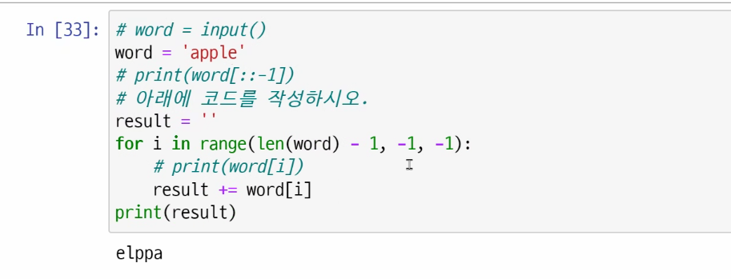

``` python
numbers = [7, 10, 22, 4, 3, 17]

#내장함수를 쓰지 않고 구하기
#기본적으로 최대, 최소 구할 때 쓸 수 있는 내장함수가 있음( max(numbers), min(numbers) )

#내장함수를 사용하지 않고 직접 구현하기
#초기값을 주어진 자료값보다 작게 설정할 경우
max_val = 0 #지금 numbers 리스트는 자연수니까 0 설정
max_val = 0
for var in numbers:
    if max_val < val:
        max_val = val
print(max_val)


#초기값을 첫번째 값으로 설정할 경우
max_val = numbers[0]
for val in numvers:
    if max_val < val:
        max_val = val
print(max_val)

#최솟값을 설정할 경우
min_val = numbers[0]
for val in numbers:
    if min_val > val:
        min_val = val
print(min_var)

```

```python
#일반적인 코드
max_val = numbers[0]
for i in range(1, len(numbers)):
    if max_val < val[i]:
        max_val = numbers[i]
print(max_val)
```

```python
#최대(최소)값의 위치 구하기
max_idx = 0
for i in range(1, len(numbers)):
    if numbers[max_id] < numbers[i]:
        max_val = i
print(max_idx, numbers[max_idx])
```


