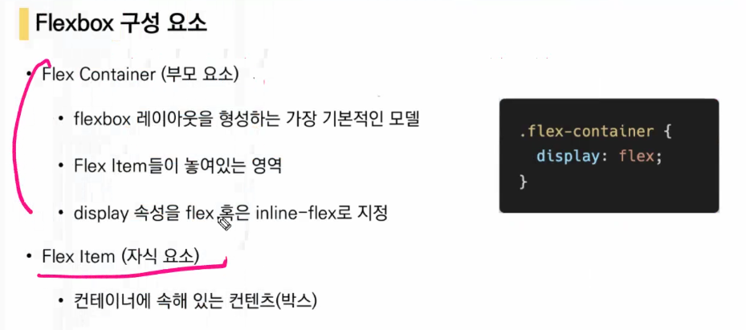

전ㄴ체 보더까지 사이즈로 보겠다

컨텐츠영ㅇ역을 내가 너비로 지정을 하겟다 <- 두 개 알아두기

# css layout

inline block -> 상하 너비는 못 줌 

###### 이런게 가능할까?

어떤 요소를 감싸는 형태로 배치는? 혹은 좌/우측 배치는?

---

### float

float의 기본 구조

---

clearing

결과

clear 속성은 부모 요소한테 부여 한다!

---

---

space-between : ~ㅅ ㅏ이에 (아이템 사이에 균등하게 (남은)공간을 넣어줌 )

space-around : 가질 수 있는 여백을 아이템들에게 다 나누어줌

아이템들 사이에 두고 같음지 -1- -2- -3-

space-evenly : 좌우 여백 모두 동일, 여백 전체를 같게 보는지

-1-2-3-

flex-wrap(nowarp, wrap)

flex-flow : row nowrap -> 둘 다 설정 가능

마무리

float 

flex- 새로운 패러다임

축, 컨테이너(부모 요소 밑 애들을 컨테이너로 보고, 다루기)

----------------------

## 교수님

메인축 먼저 생각 후, 교차축 생각하기

기본은 가로 (좌->우로 흘러가는 방향)

교차축 : 당연히 직교하는 축

만약 메인을 세로(수직방향)으로 한다면, 교차축은 가로

반드시 바깥에 컨테이너를 둘러싸고 있는 부모에다가 속성 적용!

물론 각각 아이템들에 대해서도 적용할 수 있지만, 부모에 대해서 적용 하는 것

부모 display를 flex라고 씀

display: flex 속성 부 여

부모 안에 있는 item들, 자식들이 기본적으로 메인축이 default로 가로방향이기 때문에, 메인 축이 설정된 상태에서 배치가 된다는 말이지

그래서 메인축이 정의되면 가로방향 중 좌측이 start, 우측이 end가 됨

교차축: 상:start 하:end

부모한테 적용

flex-direction <- 메인 축 설정 keyword

flex-direction : row (좌->우) / row-reverse(우->좌) / column(상->하)/column-reverse(하->상)

!!중요!!

지정! 중요!

배치 설정

공간나누기, 정렬 꽤나 중요할수도~

flex-wrap

nowrap - 공간을 스스로 줄임 (그래도 content box만큼은 안줄임ㅁ)

wrap - 컨테이너 크기가 박스 크기보다 크면, 밑으로 내려감

flex container에선 magin:auto를 하면 가운데 배치 가능(main, cross 둘 다에서 auto)

그냥 magrgin은 좌우가운데만 가능

그럼 오ㅙ block에서는 margin auto는 가운데인가염?

기본적으로 위로 붙는 형태이기 때문에^^!

상하에 margin이 붙어있지 않아서, 배분할 게 없었음

auto를 배분해버리면, 이 순간에 다른 flex를 통해서 하는 어떠한 justficontent 같은 것들은 적용이 되지 않음

상황에 맞게 운용하자 ^^

# BOOTSTRAP

크기 한 번 봐두기

12를 넘어가게 되면 다음줄로 넘어가게 됨

비워놓고 몇 칸에 값을 주어야 하는지?

breakpoint 물어보기 좋을 것 같음

col-sm-3 col-lg-5

lg 이상일 땐 5

sm이상일 땐 3,

sm-lg전까지 3

그럼 sm 전보다 작은 경우는? 

안쓸 경우 12칸 적용됨

그래서 sm 이하를 적어두어야 함 (ex. col-2)

