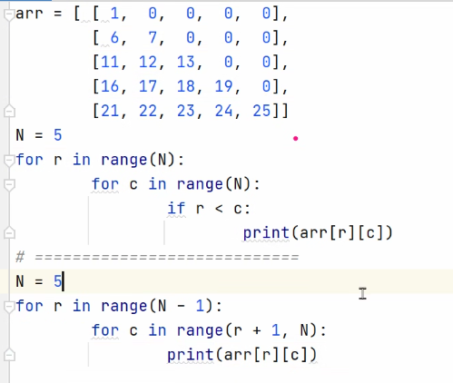
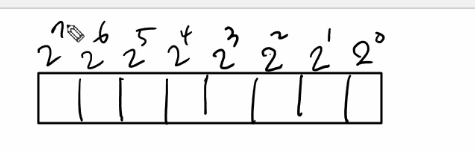
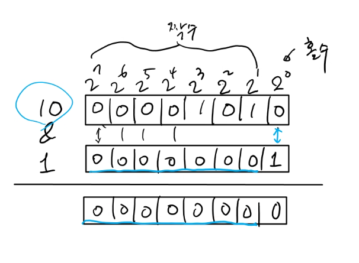

0214 유라


배열2

---

웹엑스 교수님 설명


#### 배열 바꾸기 



밑줄은 조합과 관련있다

---


함 써 볼까유


메모리는 물리적으로 이야기하는건 아닌데

메모리는 다 1하고 0밖에 없음 공백, . , 쉼표 같은 거 없음

1과 0으로 표현하는데 


저장되어있는 공간의 크기가 같음 

10이든 100이들 들어와서 채워지고, 나머지 공간은 다들 0으로 채워짐


기본적으로 같은 비트의 위치끼리 계산을 해야함


10 & 7 -> 2가 나옴


비트 오퍼레이션은 알고리즘에서 많이 씀 (파이썬에서는 많이 안쓰는뎁)

비트 연산자

- 알고리즘 문제 해결에 비트 연산자를 종종 활용한다
  - 왜? 비트 연산자는 다른 연산자들에 비해 실행 사이클이 짧다.

실행 사이클(CPU를 사용하는 시간)

다른 연산자들에 비해서 굉장히 빠름

아주 우리가 느끼기 어려운 정도로, 그것보다 더 빠를 수도 있음

근데 이제 우리가 쓰고 있는 많은 연산자들이 있는데, 

사칙 연산자들 (+ - % x and or < >)에 비해서 비트 오퍼레이션이 굉장히 빠름 

물론! 찾아봐야겟지만 파이썬은 글쎙? 빠른지 잘 모르겠음

일반적으로 다른 언어에서는 굉장히 빠름 물론 한두번 돌리는 것으로는 차이가 많이 안남 

수십만번, 수백만번 반복해서 실행된다고 했을 때 티끌같은 차이가 누적되면 차이가 좀 큼

상위레벨에 가면 시간 가지고 싸우기 땜운에 ㅎㅎ

답은 다 맞춤, 그게 문제가 아니라 얼마나 더 효율적인 코드를 작성하냐 

- 
  - 수식을 간결하게 표현할 수 있음

```
n = 5
if n & 1:
	print('홀수')
else
	print('짝수')
```

```
/(나누기)와 %(몫) 연산자는 가장 느린 연산자임
실수가 정수보다는 속도가 느릴 수 밖에 없으닉간

만약 8자리 2진수를 저장한다고 쳐, (최대 8자리까지 저장하려고 함)
```



```
2^0 말고 나머지는 다 짝수임(2의 제곱수니까)
그래서 1을 더했을 때 홀수인지 짝수인지 알 수 있음
```



````
맨 뒤에 1을 제외하고 앞 칸들은 다 0일거임 (왜냐면 &1이니까 0000000000000001) -> 둘 다 1이어야 1이 나오는데 앞에는 다 0 이닉간 당연히 0~
````

대표 ex

홀짝 판별

나누기

```
```


---

shift 연산자

print(1 << 0)

print(1 << 1)

print(1 << 2)

print(1 << 3)

```
1,2,4,8이 나옴
<- 방향을 나타내고 있음 (옆으로 몇 칸을 밀거야!)
```


```
2^0에 있던 애가 1 밀리게 되면 2^1이 되기 때문에 2가 됨
2^0에 있던 애가 2 밀리게 되면 2^2가 되기 때문에 4가 됨
2^0에 있던 애가 3 밀리게 되면 2^3이 되기 때문에 4가 됨
```

```
<<1 : *2
<<2 : *4

>>1 : /2 (소수점은 자연스럽게 버린당 몫이라고 생각해두 되나?)
```

```
범위를 2분할 할 때 많이 사용함

```


---


입력으로 2차 배열 주어짐

크기는 100*100

첫번째 테스트 케이스(번호가) 주어짐

행우선, 열우선, 대각선 순회


