# 0302 Django TIL

#### setting.py

```
firstpjt(VENV 내 생성한 프로젝트) > settings.py(프로젝트 내 기본 설정 파일) > 33line(INSTALLED_APPS)
```

##### 반드시 생성 후 등록(선등록 후생성 시, 앱이 생성되지 않음)

```python
INSTALLED_APPS = [
    'django.contrib.admin',
    'django.contrib.auth',
    'django.contrib.contenttypes',
    'django.contrib.sessions',
    'django.contrib.messages',
    'django.contrib.staticfiles',
]
```

##### Django가 권장하는 앱 등록 순서

```
LOCAL APPS(직접 만든 앱들) -> THIRD PARTY APPS(서드파티 앱들) -> DJANGO APPS(기존에 존재했던 장고 앱들)
```

순서를 지키지 않아도 수업 과정에는 문제가 없지만, 추후 단계가 심화하면서 등록 순서가 유의미한 순간이 옴. 그럴 때를 대비하여 앱 등록 순서를 지키면서 진행 예정

#### URL.py

```
firstpjt > url.py
```

###### 핵심코드

```python
from django.contrib import admin
from django.urls import path

urlpatterns = [
    path('admin/', admin.site.urls),
]
```

```
admin/ 은 무엇을 의미하는가?

-> url 주소의 일부 (처음에 만들어져 있는 주소)

-> 존재 하는가? (git bash -> python manage.py runserver)
```

`python manage.py runserver` -> `Starting development server at http://127.0.0.1:8000/`

http://127.0.0.1:8000/

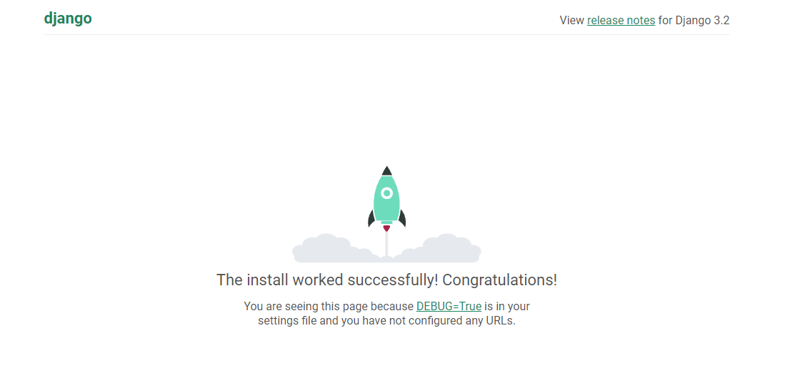

여기서 /admin을 추가해보자

http://127.0.0.1:8000/admin

-> http://127.0.0.1:8000/admin/login/?next=/admin/

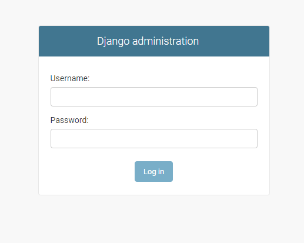

```
url이 미리 만들어져 있는 이유가 있었음
django는 기본적으로 admin page가 기본적으로 만들어져 있음(admin에 대해 기본적으로 동작들이 만들어져 있음)
-> framework에서 admin에 대해서 기본적으로 제공하는 건 많이 없음.
일단은 이런 페이지가 존재함을 기억해두자.
```

###### 로켓 페이지를 보는 원리

```
우리는 클라이언트-서버 모두를 사용하고 있음(크롬-장고)

우리는 http://127.0.0.1:8000/ 라는 주소를 서버에 요청을 하고, 서버는 우리한테 로켓 페이지 주소를 클라이언트한테 제공, 클라이언트는 렌더링해서 우리에게 페이지 제공.

admin도 같음. admin을 장고 서버에 urls.py가 문자열과 매칭되는 path를 찾아서 두번째 인자를 호출

path('admin/', admin.site.urls)
=> 주소 뒷면에 admin이 붙어있다면, 두번째 인자인 admin.site.urls를 호출(관리자 페이지를 응답하면 되겠다!! 해서 서버에 보냄)
url 입력 + enter => 서버에 요청을 해 응답을 받는 과정 (속도가 너무 빨라 응답-요청이라고 생각 못했을 뿐)
```

```
장고는 end slash를 반드시 붙여야 함 'index/' -> / 필수!
path('index/', ~~)
~~ 에는 응답할 메인 페이지가 필요함. 메인 페이지를 하기 위해선 view가 필요! view!, 보여지기 위해서 template도 필요.
view는 함수들로 이루어짐
```

```
views.py  -> 일종의 모듈
firstpjt에서 articles 내부에 있는 views.py를 불러와야함.
어떻게 해야할까?
__init__.py -> 파일을 하나의 파일로 인식하게 함
from articles import views -> views를 불러올랩!
->     path('index/', views.???)

path('admin/', admin.site.urls),
list 안에 하나 뿐인데, 왜 ','를 사용하는가 ?
django에서는 trailing comma(,)를 권장 (이따 나오는 dictionary에도 사용 ! )
왜? 
다른 것들을 추가해서 사용할 때, 바로 사용할 수 있게끔!
```

###### view함수의 필수 규칙

```
반드시 받아야하는 인자가 존재. request 라는 인자!
HTTP request 객체임
(이 안에 정보가 다 들어있음. 이걸 view가 사용하는 것이기 때문에 무조건 view 함수에서 첫번째 필수 인자임! )
```


추가 경로 등록

settings -> 55line -> dir

```
원래 dir=[]
->
articles, firstpjt랑 같은 위치에 templates 생성 (원래 articles 안에 있어야하는데 밖에 생성했으니까 django는 절대 모름)
그러니까 django한테 여기도 읽어달라고 요청

요청 코드
==> firstpjt > settings.py > 55line > 
!!'DIRS' : [BASE_DIR / 'templates',], !!
로 설정

파이썬 객체지정처럼 'templates' 라는 경로 설정 해주는 것
그럼 BASE_DIR은 뭐임? settings.py 16line에 존재
BASE_DIR -> 장고 프로젝트를 가지고 있는 최상단 폴더
우리가 django를 사용하고 있는  폴더 (우리가 시작하는 폴더) -> BASE_DIR (너 시작 할 때, 최상단 폴더(우리가 위치하고 있는 폴더)에서 시작해 ㅎㅎ)
BASE_DIR / 'templates' -> 최상단 폴더에서 templates 폴더도 이제 확인해야해 ^^

그럼 왜 c/users/aisd or ./articles/dd 같은 폴더는 안써? 왜 객체 지향적인 파이썬 기반 코드를 사용해?
운영체제가 각각 다르기 때문에 파이썬의 객체지향 시스템을 사용하는 것 (운영체제에 맞춰 알아서 번역해주기 때문에 고려할 필요가 적어짐)
```


----


실행순서

```
1)python -m venv venv
2) ctrl+shft+p > python interprinter > 가상배경 선택
3) git bash 죽이고 다시 실행
4) pip install django==3.2.12
5) django-admin startproject fitstpjt .
(firstpjt라는 이름의 프로젝트 폴더 생성(.은 이곳에 생성한다))

```

```
6) python manage.py startapp articles
(articles라는 app 생성)
-> setting.py > INSTALLED_APPS에 'articles', 추가
(내가 생성한 app을 설치한다.)

!앱 이름을 작성할 때, 복수형으로 권장!
(DB만들 때, table을 만들기 위해서(우리는 직접 table을 만드는 건 아니고, table에 대응되는 class를 정의할 것) class 객체를 정의할 때, 단수형으로 정의(articles-> article))
```

실행 순서는

`urls.py`  >  `views.py`  >  `template` 

(근데 views랑 template랑 같이 볼 수 있음 시간이 지나면)


7)`firstpjt` > `urls.py` > `from articles import views ` > `path('dtl-practice/', views.dtl_practice),`

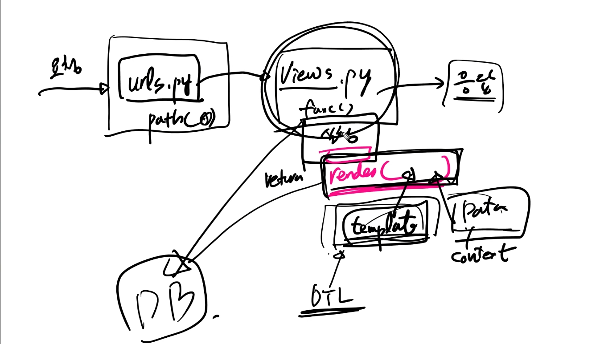

```
작성할 때 항상
urls.py > views.py > template(직접작성)
urls.py에 path 등록(path('A', B)) [A,B 결정]
작성을 하면, 실제 함수를 작성 해야 하니까
urls.py에 등록한 것을 views.py에 가서 작성 해야함
그리고 html에 response를 던져도 되겠지만, templates라는 것을 이용해서 만들어야 함
views와 templates는 만드는 순서(수정 순서)
동시에 만들고 작성할 가능성이 큼(물론 view먼저, templates를 나중에 만들지만 나중에는 동시에 작업할 수도 있다)
우선 templates를 어떻게 보여줄 지, 디자인을 해야하고 틀을 만들어야 함. 실제 채워넣을 데이터는 어떤 데이터를 채울지를 준비를 해가지고 views.py에서
templates한테 넘겨줘야함
넘겨주는 과정에서 templates에 실제로 넘겨줄 데이터를 가져올 때, DB에서 가져올 수 있음
자체적으로 내부에서 만들어서 가져올 수 있겠지만 대부분 어딘가에 만들어져 있는 DB를 가져와서 넘겨줄 데이터를 가져다가 정리를 하거나 다시 가공을 하거나 해가지고 템플릿에 넘겨줘야함

```

```
요청이 오면, 실제로는 web server가 받겠지만 생략하고
urls.py
요청 > urls.py의 path(내부에 존재해있는 내용을 참조해서 requests를 해결) > views.py에 존재해있는 함수 코드 실행 (실행하는 과정에서 마지막에 render()를 return한 것을 응답으로 날아감)
```

---

## VSCODE & WEB 매칭

##### urls.py

```python
from django.contrib import admin
from django.urls import path
from articles import views

urlpatterns = [
    path('admin/', admin.site.urls),
    path('dtl-practice/', views.dtl_practice),
]
#path dtl-practice/ 추가 & form articles import views 추가
```

##### views.py

```python
def dtl_practice(request):
    name = 'Kim ae-ri'
    foods = ['짬뽕', '치킨', '막국수', '냉면', '샤브샤브']
    users = []
    info = {
        'name' : name,
    }
    context = {
        'info' : info,
        'foods' : foods,
        'users' : users,
        'color' : 'red',
        'colors' : 'blue',
    }
    return render(request, 'dtl_practice.html', context)
```

##### dtl_practice.html

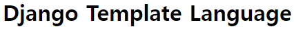

```html
<h1>Django Template Language</h1>
```

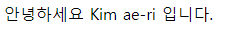

```html
<p>안녕하세요 {{ info.name }} 입니다.</p>
```

`단순한 p태그 및 | 사용`

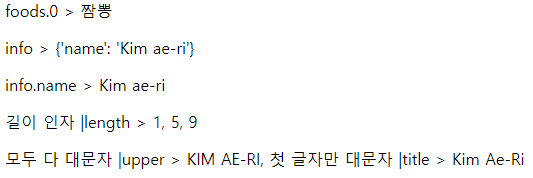

```html
<p>foods > {{ foods }}</p>
<p>foods.0 > {{ foods.0 }}</p>
<p>info > {{ info }}</p>
<p>info.name > {{ info.name }}</p>
<p>길이 인자 |length > {{ info|length }}, {{ foods|length }}, {{ info.name|length }}</p>
<p>모두 다 대문자 |upper > {{ info.name|upper }}, 첫 글자만 대문자 |title > {{ info.name|title }}</p>

```

###### for_endfor

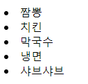

```html

  <li> {{ food }} </li>

```

###### if_endif (not, else)

`if not users_endif`

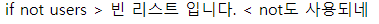

```html

  <p>if not users > 빈 리스트 입니다. < not도 사용되네 </p>

```

`if users_else_endif`

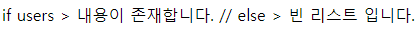

```html

  <p>내용이 존재합니다.</p>

  <p>if users > 내용이 존재합니다. // else > 빈 리스트 입니다.</p>

```

###### for_endfor(empty, if, if_length(|))

`for_empty_endfor`

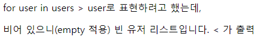

```html

  <p> {{ user }} 로 표현하려고 했는데</p>

  <p> for user in users > user로 표현하려고 했는데, </p>
  <p>비어 있으니(empty 적용) 빈 유저 리스트입니다. < 가 출력</p>

```

`for_if_endfor`

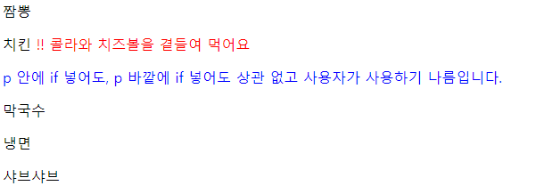

```html

  <p>{{ food }}
    
      <span style="color:{{ color }}"> !! 콜라와 치즈볼을 곁들여 먹어요</span>
      <p style="color:{{ colors }}">p 안에 if 넣어도, p 바깥에 if 넣어도 상관 없고 사용자가 사용하기 나름입니다.</p>
    
  </p>

```

`for_if|xxx_endfor`

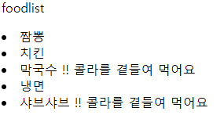

```html
<p>foodlist
  
    <li>{{ food }}
      
        <span> !! 콜라를 곁들여 먹어요</span>
      
    </li>
  
</p>
```

###### now

`DATE_FORMAT`

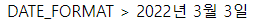

```HTML
<p> DATE_FORMAT >
  
</p>
```

`DATETIME_FORMAT`

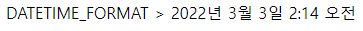

```HTML
<p> DATETIME_FORMAT >
  
</p>
```

`SHORT_DATE_FORMAT`

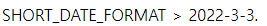

```HTML
<p> SHORT_DATE_FORMAT >
  
</p>
```

`SHORT_DATETIME_FORMAT`

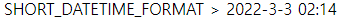

```HTML
<p> SHORT_DATETIME_FORMAT >
  
</p>
```

`Y-m-d H:i`

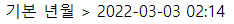

```HTML
<p> 기본 년월 >
  
</p>
```

`y-m-d H:i`

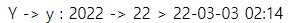

```
<p> Y -> y : 2022 -> 22 >
  
</p>
```

`Y-m-d h:i`

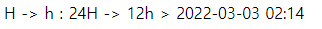

`Y-m-d H:i:s`

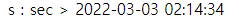

```HTML
<p> s : sec >
  
</p>
```

